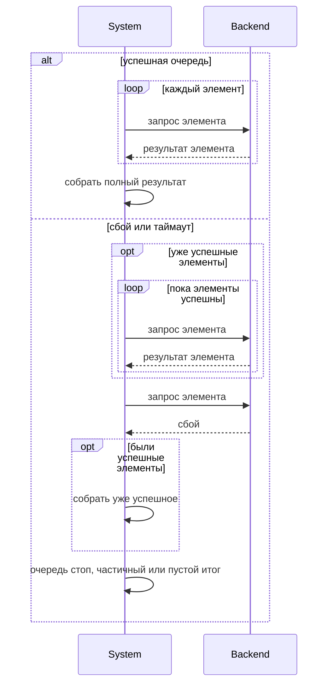
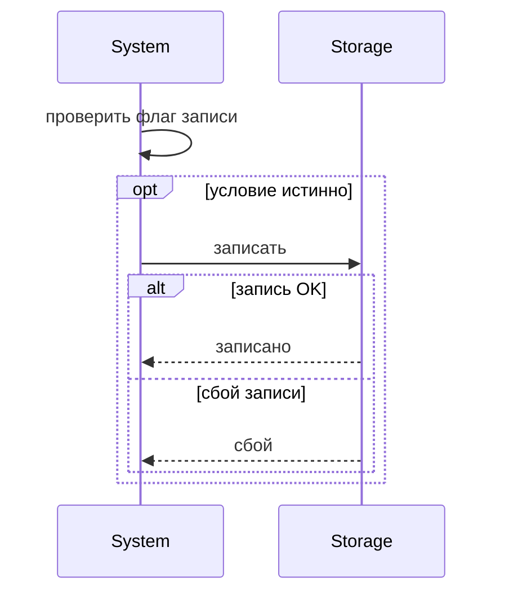
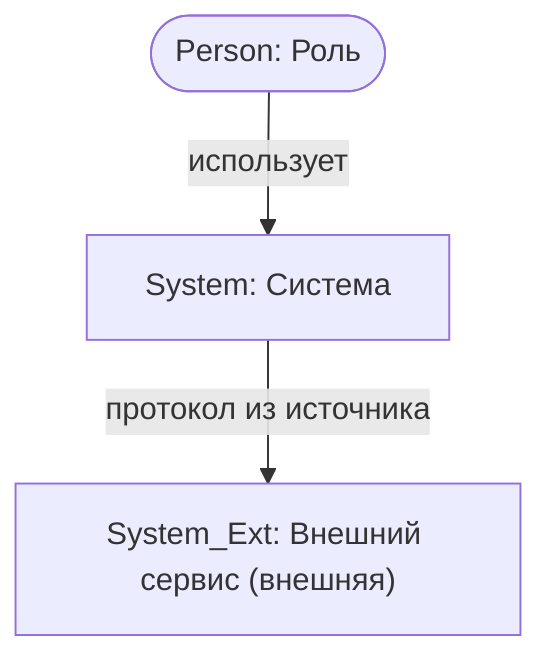

# Mermaid: flowchart, DFD, classDiagram, sequenceDiagram и C4

Универсальный скилл системного аналитика. Не подставляй факты, термины и правила другого проекта. Не привязывай формулировки скилла к названию или домену текущего репозитория. Роли, шаги, сущности, атрибуты, интеграции и потоки данных бери **только** из входных артефактов и явных указаний пользователя.

## Когда применять

- Пользователь просит Mermaid: flowchart, DFD, class diagram, sequence, C4 / архитектуру, noun extraction, потоки данных.
- Запущена команда `/diagram-mermaid`.
- Нужно пересоздать или поправить уже существующий `diagram-mermaid-NNN.md`.
- Нужно ревью соответствия диаграммы источнику без смены бизнес-смысла.

Не применяй вместо `/ft`, `/nft`, `/us`, `/uc`, если задача только про требования или сценарии **без** диаграммы. Для BPMN 2.0 (bpmn.io) используй `/diagram-bpmn`.

---

## Результат (формат файлов)

По умолчанию (если пользователь не указал иной путь) — папка `diagrams/`:

| Артефакт | Файл | Содержание |
| --- | --- | --- |
| Диаграмма + разбор | имя из запроса **или** `diagram-mermaid-NNN.md` | Текстовые пояснения **перед** блоком(ами) Mermaid |
| Опционально | краткое резюме в чате | Путь, тип, ключевые выводы; **не** дублировать весь файл |

Статус новых диаграмм: черновик для согласования, пока пользователь явно не утвердил.

### Именование и нумерация

**Приоритет имени:** явное имя / префикс / номер из запроса пользователя важнее канона скилла. Не «исправляй» на `diagram-mermaid-NNN` и не предупреждай про «неканоническое» имя. Предупреждение — только при риске **затереть уже существующий** файл.

- **Если пользователь задал имя** (пример: `diagram-dfd-001.md`): сохранить / переименовать именно так.
- **Если имя не задано** — дефолт: префикс `diagram-mermaid-` + **трёхзначный** номер (пример: `diagram-mermaid-001.md`).
- **Новый** предмет моделирования: следующий свободный номер в **том семействе имён**, которое выбрано (заданное пользователем или дефолт `diagram-mermaid-*`). Не перезаписывать чужие диаграммы. Если папки нет — создай и начни с `001` в выбранном семействе.
- **Пересоздание / правка** той же диаграммы (тот же процесс / срез и тот же основной тип): оставить **прежнее** имя файла и обновить содержимое на месте.
- Уровни DFD (0 и 1) и уровни C4 (L1/L2/L3) одного среза — **в одном файле**, отдельными блоками Mermaid.
- Несколько **разных** типов (например flowchart и sequence одного UC) — отдельные файлы с разными номерами, если пользователь не просил объединить.
- Если в правилах репозитория задан иной путь — следуй правилам репозитория; имя файла при этом по-прежнему берётся из запроса пользователя, если оно указано.
- Если пользователь сказал «папка diagram», а в проекте канон `diagrams/` — сохрани в каноническую папку и кратко сообщи фактический путь.

### Формат вывода по умолчанию

Отдельный `.md`-файл:

1. Заголовок и метаданные (тип диаграммы; статус черновика при необходимости).
2. Ссылки на источники.
3. Текстовый разбор **перед** диаграммой (шаги / акторы / сущности / связи — по типу).
4. Один или несколько блоков с языком `mermaid` (уровни DFD и C4 — **отдельно**). Для **sequenceDiagram** — только после письменного прогона §4.6 в текстовой части того же файла.
5. Краткие замечания / строка «Проверено: …». Для C4 — комментарий под каждой диаграммой. Для sequence — в «Проверено» явно §4.6.

Исключения (только если пользователь явно просит иное):

- отдельный `.mmd` **без** поясняющих комментариев внутри файла;
- SVG / ссылка на SVG;
- только блок Mermaid в чате без `.md`.

В `.md`-артефактах проекта **запрещён** fence ` ```text ` и пустой ` ``` ` для длинных цитат. Допустим осмысленный язык fence (`mermaid` и т.п.). Примеры синтаксиса в этом скилле — в блоках `mermaid` или обычным markdown-списком, не через `text`.

---

## Прогресс задачи

Копируй и отмечай по ходу:

- [ ] 1. Прочитать источники; отделить факты от допущений
- [ ] 2. Определить тип (flowchart / DFD / classDiagram / sequenceDiagram / C4); если не указан — уточнить с рекомендацией
- [ ] 3. Выполнить чек-лист **только выбранного** типа: flowchart → §1; DFD → §2; classDiagram → §3; sequenceDiagram → §4; C4 → §5. Остальные типы **не** выполняй и **не** рисуй «заодно»
- [ ] 4. Если тип **sequenceDiagram**: прогнать спецификацию по §4.6.1–§4.6.7 (находки — в тексте файла, включая арифметику `end`). **Не** писать fence `mermaid`, пока все пункты закрыты
- [ ] 5. Имя файла: из запроса пользователя; иначе дефолт `diagram-mermaid-NNN` (новый → +1 в семействе; тот же артефакт → то же имя)
- [ ] 6. Записать файл (текст → затем Mermaid; для `.mmd` — только Mermaid)
- [ ] 7. Пройти общие проверки (§6) и типовые (§1.3 / §2.4 / §3.5 / §4.5+§4.6 / §5.5)
- [ ] 8. Отдать путь + краткий разбор; перечислить, что проверено

Диаграмму **не считай готовой**, пока не пройдены проверки §6 и блока выбранного типа и пока пояснения не стоят **перед** Mermaid (кроме явного `.mmd`-исключения). Sequence без прогона §4.6 **не готова**.

---

## 0. Источники и границы

1. Читай только источники **текущего** репозитория и явные вложения (`@файл`, текст в чате). Не читай архивные папки без явного `@`.
2. Не выдумывай шаги, роли, сущности, атрибуты, ветки, интеграции и потоки данных вне ввода.
3. Термины — из глоссария / требований / US / UC / API / кода проекта; новый устойчивый термин предложи зафиксировать, не вводи молча.
4. Моделируй поведение / структуру из источника; не подменяй solution design без запроса.
5. Одна диаграмма (или согласованный набор уровней DFD/C4) = один срез. Не смешивай независимые процессы без запроса.
6. Если ввода мало — вопросы с **рекомендацией** ответа; черновик помечай как требующий согласования.
7. При конфликте «красивая схема» vs «верность источнику» — **верность источнику**.
8. Смежное вне среза — не рисуй или явно перечисли как «вне диаграммы».

Типы (если не указан — уточни):

| Тип | Когда |
| --- | --- |
| **flowchart** | процесс / сценарий (шаги, ветвления, начало/конец) |
| **DFD** | потоки данных (уровень 0 и/или 1) |
| **classDiagram** | модель классов (noun extraction из US/описаний) |
| **sequenceDiagram** | взаимодействие участников во времени |
| **C4** | Context / Container / Component (+ опционально Dynamic / Deployment) |

---

## 1. Flowchart (процесс)

### 1.1. Чек-лист аналитика

Явно зафиксируй в тексте файла:

1. Все **шаги** основного потока (и альтернативы/исключения, если есть в источнике).
2. **Точки ветвления** (условия) с привязкой к шагам источника; стабильные id (`B1`, `B2`).
3. **Начало** (триггер / предусловие → первый шаг).
4. **Все концы** (успех, пустой результат, ошибка, прерывание, выход во внешний сценарий, повтор цикла — только если есть в источнике).
5. При необходимости: что **намеренно не** включено в диаграмму.

Не добавляй шаги и ветки «для красоты». **Фильтр/правило внутри шага без видимой развилки для актора** — в имя шага или примечание, **не** обязательный отдельный ромб.

Не подменяй процесс flowchart’ом «экранов» (каталог, кабинет, «страница») без шагов и решений из источника.

### 1.2. Оформление Mermaid

- Тип: `flowchart TD` (или `LR`, если так читаемее / пользователь просит).
- Старт/финал: `([текст])` или `((текст))`; действие: `[текст]`; решение: `{условие?}`.
- Подписи стрелок — **смысл исхода**, не только код; код источника допустим в скобках для трассировки (пример: `да (B1)`, `отказ (шаг 5.1)`).
- Повторы: явные исходы с возвратом к шагу или к концу прохода (не прятать цикл в неподписанной стрелке).
- Текст в узлах — короткий; детали — в пояснениях выше.
- Id узлов — латиница без пробелов; не дублируй id.
- Не рисуй декоративные узлы про UI/скрытие данных, если это ограничение, а не шаг — упомяни в пояснениях.

Минимальный скелет:

```mermaid
flowchart TD
  Start([Старт: …]) --> Step1[…]
  Step1 --> B1{B1: …?}
  B1 -->|да (B1)| PathA[…]
  B1 -->|нет (B1)| PathB[…]
  PathA --> EndA([Конец: …])
  PathB --> EndB([Конец: …])
```

### 1.3. Проверки flowchart

- [ ] Каждый шаг источника отражён или сознательно исключён с пометкой
- [ ] У каждой ветки есть условие и все исходы из источника
- [ ] Есть старт и все заявленные финалы
- [ ] Нет противоречий с источником
- [ ] Нет лишних ромбов для внутренних фильтров без развилки для актора
- [ ] Нет flowchart «экранов» вместо процесса

### 1.4. Шаблон текстовой части (flowchart)

1. Начало и концы (таблица кодов исходов при необходимости)
2. Шаги процесса
3. Точки ветвления
4. Диаграмма (`mermaid`)
5. «Проверено: …»

---

## 2. DFD (потоки данных)

### 2.1. Чек-лист аналитика

1. **Внешние сущности** (люди-роли и внешние системы из источника). Внутренняя «Система» / платформа — **не** внешняя сущность: она = процесс(ы).
2. **Процессы преобразования** данных (на уровне 1 — логические пакеты по сценариям источника; не раздувай и не схлопывай без причины).
3. **Хранилища** — логические, **не** обязаны быть 1:1 с агрегатами DDD / сущностями доменной модели / таблицами БД. Похожие объединяй, если это не ломает смысл потоков. При мелком MVP или избыточной дробности **сначала предложи укрупнение** (с рекомендацией), не жди жалобы «многовато». При слиянии в тексте файла кратко: что объединено и какое различие остаётся в доменной модели (если оно важно).
4. У **каждой стрелки** — имя **данных** (что передаётся), не действие UI.
5. Уровни:
   - **0 (контекст)** — один процесс всей системы + внешние сущности;
   - **1** — декомпозиция процессов + хранилища.
   Рисовать **отдельными** блоками Mermaid.
6. **Сохранение данных:** ничто не появляется «из ниоткуда» — у читаемого хранилища есть писатель; факты опираются на вход извне или на ранее сохранённый снимок. Зафиксируй таблицу/абзац проверки происхождения данных.

### 2.2. Нотация в Mermaid flowchart (DFD)

| Элемент DFD | Mermaid |
| --- | --- |
| Внешняя сущность | прямоугольник `Name[...]` |
| Процесс | круг `Name((...))` |
| Хранилище | цилиндр `Name[(D1 ...)]` |
| Поток данных | именованная стрелка `-->\|данные\|` |
| Вне границы системы (доставка, внешний стрим и т.п. — только из источника) | пунктир `-.->` |

### 2.3. Термины

- Подписи — язык **источников** (глоссарий, UC, US).
- Не подменяй доменные термины англоязычным жаргоном (`auth`, `CRUD`, `redirect`), если в источнике есть деловая формулировка.
- Технические ярлыки — только если так в источнике или пользователь явно просит.

### 2.4. Проверки DFD

- [ ] Все внешние акторы из источника учтены (или исключены с пометкой)
- [ ] Процессы трассируются к UC/US/описаниям
- [ ] Каждая стрелка именована данными
- [ ] Уровень 0 и 1 согласованы между собой
- [ ] Таблица/абзац проверки происхождения данных заполнены
- [ ] Процессы — круги, внешние — прямоугольники, хранилища — цилиндры
- [ ] Уровни 0 и 1 не смешаны на одном рисунке
- [ ] Хранилища не раздуты 1:1 с DDD без нужды; при избыточности предложено / применено укрупнение с пометкой

---

## 3. classDiagram (noun extraction)

### 3.1. Чек-лист аналитика

1. Выписать **существительные-кандидаты** из US / описаний (story + AC).
2. Убрать дубликаты, местоимения, UI-абстракции (страница, кнопка, список как экран), чисто внешние системы (если не моделируете их как классы по просьбе), синонимы.
3. Сформировать список **классов** с обоснованием по источнику.
4. Для каждого класса — **атрибуты из US/описаний**:
   - число атрибутов зависит от конкретных US/AC; не навязывай квоту «ровно N» / «не больше M», кроме явной просьбы;
   - если атрибутов много — кратко обоснуй в тексте;
   - если у роли мало собственных полей — не выдумывай; либо оставь мало полей, либо (по просьбе) продублируй унаследованные с пометкой «для отображения».
5. Связи и мощности:

| Смысл в источнике | Тип связи | Mermaid |
| --- | --- | --- |
| кто «создаёт» / использует / связан | ассоциация | `-->` |
| «содержит», часть **не** живёт без целого | композиция | `*--` |
| «содержит» / владеет, часть самостоятельна | агрегация | `o--` |
| кто «является» | наследование | `<\|--` |

Мощности: `1`, `0..1`, `1..*`, `0..*` (иные — только если явно следует из источника).

6. Роль без учётной записи (гость / аноним): если по US у неё есть действия до регистрации — **включай класс**, даже без наследования от «учётной записи»; действия — ассоциациями. Не оставляй действия «бессубъектными».
7. Объединение классов — только по явной просьбе или если в источнике это один объект; зафиксируй упрощение в замечаниях.

### 3.2. Соглашения имён (если пользователь не задал иные)

- Имена классов на диаграмме — на языке документации проекта.
- Для совместимости превью: латинский **ID** + отображаемое имя: `class Order["Заказ"]`.
- Атрибуты по умолчанию — **английские** идентификаторы (`title`, `status`), если пользователь не просит иное.
- По запросу или по умолчанию для аналитических моделей: первым атрибутом — `id` (технический), **дополнительно** к бизнес-ключам из источника.

### 3.3. Таблица атрибутов перед диаграммой

| Класс | Атрибуты | Название / описание (на языке документации) |
| --- | --- | --- |

- Одна строка = один класс.
- Все атрибуты класса — в одной ячейке (разделитель `;` или `,`).
- Все описания — в одной ячейке, в **том же порядке**, что и атрибуты.

### 3.4. Проверка покрытия (обязательна)

Явно оцени в файле или в ответе:

1. Все ли нужные сущности из US указаны.
2. Хватает ли сущностей предметной области.
3. Нет ли лишних / слишком абстрактных элементов; абстрактный элемент — **аргументируй**.

### 3.5. Проверки classDiagram

- [ ] Noun extraction и отбор задокументированы
- [ ] Атрибуты трассируются к US/AC; число соответствует конкретным US
- [ ] Связи типизированы; мощности проставлены
- [ ] Таблица атрибутов перед диаграммой, по одной строке на класс
- [ ] Выполнена проверка покрытия (§3.4)
- [ ] UI-экраны не выданы за классы предметной области без основания в US

---

## 4. sequenceDiagram (взаимодействия)

Используй, когда нужно показать процесс как обмен сообщениями во времени. Источники: UC, OpenAPI, ФТ с операциями, явное описание в чате. Участников и слои **не** добавляй из типового шаблона, если их нет во вводе.

### 4.1. Чек-лист аналитика

1. Зафиксируй **границу процесса** из запроса (что входит / не входит).
2. Участники **только из источников** и явного списка пользователя:
   - человек / роль → `actor`;
   - система, UI, API, БД, внешний сервис → `participant`;
   - не добавляй участников «на всякий случай» (в т.ч. Frontend / API / Database), если их нет в сценарии / контракте.
3. Для каждого шага основного потока зафиксируй цепочку **как в источнике**. Шаблон Actor → Frontend → API → Database используй **только если** эти роли/слои есть во вводе (UC с UI, OpenAPI, явный список). Не добавляй Frontend/API/БД «для канона sequence».
4. Если в источнике есть UI: для пользовательского шага отрази команду человека → UI и обратную связь UI → человеку, если это следует из источника. Если UI нет — замыкай поток на участников из источника.
5. Альтернативы — из UC и/или кодов ответа OpenAPI/ФТ. Не выдумывай форматы, поля и статусы вне источников.
6. Диаграмма должна закрывать заявленный процесс целиком, а не только happy path.
7. **До** fence `mermaid` выполни §4.6 по спецификации; находки запиши в файл.

### 4.2. Участники и нотация

| Участник | Mermaid |
| --- | --- |
| Человек / роль | `actor Actor` |
| Frontend / UI, API, Database, внешние сервисы | `participant Name` |

- Id участников — латиница без пробелов (`APIServer`).
- Не используй редкие/хрупкие конструкции (`@{ type: ... }`, сложные alias), если цель — совместимость превью.
- В подписях избегай символов, ломающих рендер; при сомнении — простые ASCII-замены.

### 4.3. Основной поток и `alt` / `else`

Альтернативы оформляй как настоящие ветки `alt` / `else` с сообщениями, а **не** как текстовую плашку «ошибки: 400, 401, …» под happy path.

Типовой шаблон **для источника с UI и API** (не копируй участников, которых нет во вводе):

```mermaid
sequenceDiagram
  actor Actor
  participant Frontend
  participant APIServer
  participant Database
  Actor->>Frontend: команда из UC
  Frontend->>APIServer: METHOD /path
  alt 2xx успех
    APIServer->>Database: действие из источника
    Database-->>APIServer: результат
    APIServer-->>Frontend: 2xx
    Frontend-->>Actor: что показывает или делает UI
  else 4xx или 5xx код 1
    APIServer-->>Frontend: код и смысл
    Frontend-->>Actor: реакция UI
  else 4xx или 5xx код 2
    APIServer-->>Frontend: код и смысл
    Frontend-->>Actor: реакция UI
  end
```

Обязательные правила:

1. Если в источнике есть API-контракт: первая ветка `alt` — **успех** (2xx) с полным путём до реакции на стороне, которую видит актор (для UI — Frontend → Actor). Если API в источнике нет — ветки по исходам из UC/описания, без выдуманных HTTP-кодов.
2. Каждый значимый код ошибки из источника — отдельный `else` (не список в одной строке). Если кодов очень много и пользователь просит упростить визуал — полный набор оставь в артефакте, сокращение превью согласуй явно.
3. После **каждого** ответа системы, который должен увидеть человек, есть сообщение к актору — **если** в источнике есть UI/Frontend. Нет UI — не рисуй Frontend ради этого правила.
4. Actor **не** только получает ответы: у каждого пользовательского шага из источника есть команда Actor → следующий участник (UI или система из источника).
5. Развилки формата/решения — только из источника. Вложенность `alt` — не глубже **двух** уровней (§4.6.4). Не клади `alt`/`break` внутрь `loop`, если сбой должен остановить всю очередь (§4.6.1).
6. Не завершай схему заглушкой вроде `All errors`.

### 4.4. Трассировка к источникам

- Подписи сообщений трассируй к UC-шагам и/или operationId / METHOD+path.
- Форматы, статусы, коды — цитируй источник в текстовом разборе (или вне `.mmd`, если файл без комментариев).
- Условные интеграции («если нужен внешний сервис») — **не** рисуй участника, пока нет явного шага; отметь исключением.

### 4.5. Проверки sequenceDiagram

- [ ] Участники только из источников / явного списка
- [ ] Люди через `actor`, системы через `participant`
- [ ] Actor даёт команды на пользовательских шагах (к UI или к системе из источника)
- [ ] Если в источнике есть UI: после ответа системы, который должен увидеть человек, есть действие Frontend → Actor. Нет UI — не добавляй Frontend
- [ ] Основной поток закрывает заявленный процесс целиком
- [ ] Альтернативы — реальные `alt`/`else`, не текстовый перечень кодов
- [ ] Для API-контракта: успех 2xx и else по кодам из контракта/UC. Нет API — не выдумывай HTTP-коды
- [ ] Нет выдуманных форматов, интеграций и шагов
- [ ] Синтаксис совместимый; подписи без символов, ломающих превью
- [ ] Пройден §4.6 **до** fence `mermaid`; в файле есть краткий результат прогона и счёт `end`
- [ ] Нет `==` внутри открытых фрагментов; вложенный `alt` имеет свой `end` до внешнего

### 4.6. Anti-Pattern Guardrails (sequence, до кода Mermaid)

Жёсткие проверки. Сначала прогони спецификацию (UC / API / описание) по пунктам §4.6.1–§4.6.7, зафиксируй находки в текстовой части файла, **затем** пиши `mermaid`. Нарушение любого пункта = схема не готова, даже если «логика в голове» верна.

В текстовой части sequence-файла обязателен блок **«Проверка §4.6»** со строками «да / нет + как закрыто» по §4.6.1–§4.6.7. В §4.6.7 укажи арифметику: число `end` = число строк `alt` + `opt` + `loop` (`else` своего `end` не даёт).

#### 4.6.1. Ветвление и останов очереди

**Запрещено:** `alt` / `else` или `break` **внутри** `loop` для критического сбоя, который должен прервать **всю** последующую последовательность (полный результат, финальная запись, «успех» после цикла).

**Почему:** в UML/Mermaid итерации `loop` и сообщения **после** `loop` продолжаются. `break` внутри цикла выходит из цикла и всё равно выполняет шаги за ним. Это логический тупик: ИИ «остановил» очередь в подписи, но на схеме идут следующие фрагменты и постусловия успеха.

**Как правильно:** на **верхнем** уровне очереди две независимые ветки:

- `alt` исход 1: успешная очередь — внутри неё `loop` только успешных шагов, затем склейка/финал из источника;
- `else` исход 2: сбой / таймаут — внутри **свой** успешный отрезок (`opt`/`loop` уже выполненного), затем сбойный шаг, затем логика отмены/частичного результата из источника. Не продолжай постусловия успеха.



Если в источнике сбой на **первом** элементе (цикл успешных шагов — 0 итераций), самовызов «собрать уже успешное» и запись в поле результата **не** рисуй безусловно: только внутри `opt`. Иначе схема утверждает перезапись пустого результата.

#### 4.6.2. Иллюзия дублирования запросов

**Запрещено:** в `else` сбоя рисовать **изолированную** стрелку того же запроса, что уже есть в успешной ветке, так что на схеме это два последовательных вызова бэкенда: сначала «весь успешный loop», потом «ещё один сбойный запрос».

**Как правильно:** каждая ветка `alt`/`else` — **полный** исход, не продолжение соседней. В ветке сбоя свой контекст: вложенный `loop`/`opt` уже успешных шагов **этой** ветки и сбойный шаг как финал **этой** ветки, либо единственный запрос, который сразу завершается ошибкой (если в источнике сбой на первом шаге). Не выноси «общий» POST перед `alt` и не копируй его ещё раз в `else` как хвост успеха.

#### 4.6.3. Локальная валидация (внутреннее состояние)

**Запрещено:** слать сообщение внешнему `participant` (API, БД, папка, очередь, файловое хранилище), если система ещё не проверила флаги / настройки / предусловия из источника.

**Как правильно:** сначала самовызов `System->>System: проверить флаг или настройку`. Только если условие истинно — `opt` с сообщением к внешнему участнику. Если условие ложно, ветку `else` **к внешнему участнику не рисуй**: система с ним не связывается. Не используй `alt писать / else не писать`, где «не писать» выглядит как запрос в никуда.

Если в источнике вызов внешнему участнику **безусловен** (каждый успешный ответ API всегда пишется, без флага) — самовызов проверки не рисуй.



#### 4.6.4. Вложенность, `end` и читаемость (Mermaid)

**Запрещено:**

- более **двух** уровней вложенности `alt` друг в друга (`alt` внутри `alt` внутри `alt`);
- открытый `alt` / `opt` / `loop` без **своего** `end`;
- `== НАЗВАНИЕ ФАЗЫ ==` внутри незакрытого `alt` / `opt` / `loop`.

**Почему:** рендер накладывает слои и обрезает текст. Парсер требует парности: один `end` на каждый `alt`, `opt`, `loop`. Блок `alt` … `else` … `else` закрывается **одним** `end`. Вложенный `alt` закрывается **своим** `end`, затем внешний — своим. Разделитель `== … ==` внутри фрагмента сбрасывает стек блоков: внешний `end` «пропадает», превью Cursor даёт Parsing Error, даже если `end` в файле есть.

**Как правильно:** перед записью fence посчитай открытия и `end`. Сложный процесс режь фазами `== … ==` **только на верхнем уровне** (до первого `alt` или после полного закрытия всех фрагментов). Внутри `else` фазу обозначай `Note over Actor`, не `==`. Внутренние решения без внешнего вызова — самовызов (§4.6.3). `loop` и `opt` внутри одного `alt` допустимы; второй `alt` — последний разрешённый уровень.

#### 4.6.5. Смешение синхронного и асинхронного времени

**Запрещено:** рисовать действие человека в реальном мире (запуск локального скрипта, bat-файла, перезапуск Docker, ожидание внешней службы вне UI) как моментальное синхронное сообщение в той же цепочке UI-запросов.

**Как правильно:** `Note over User: описание долгого действия в реальном мире` — асинхронная пауза. Поток возобновляется **новым** действием пользователя в интерфейсе. Если пауза внутри открытого `else`, вторую фазу тоже пиши `Note`, не `==` (§4.6.4). Не рисуй `User->>System: запустить docker`, если система этого сообщения не принимает.

#### 4.6.6. Нулевые итерации loop (пустое «уже успешное»)

**Запрещено:** после `loop` / `opt` «успешные шаги до сбоя» безусловно вызывать сборку/склейку/запись в поле результата, если по источнику этот цикл может выполниться **0 раз** (сбой на первом элементе).

**Как правильно:** склейка или запись частичного результата — в отдельном `opt` «были успешные элементы». Сообщение «процесс не завершён» может остаться безусловным, если так в источнике. В текстовой части укажи исход «0 успешных» отдельно.

#### 4.6.7. Чек-лист §4.6 (все «да»)

- [ ] Критический останов очереди не внутри `loop` через `alt`/`break`; исходы на верхнем уровне, у каждой ветки свой обмен
- [ ] В ветке сбоя нет изолированной копии запроса, которая читается как второй вызов после успешного loop
- [ ] Внешнему participant нет стрелки без предшествующего самовызова проверки; нет `else` «не писать» к этому participant
- [ ] Вложенность `alt` ≤ 2; `== ФАЗА ==` только вне открытых фрагментов
- [ ] Реальное долгое действие человека — `Note over User`, затем отдельная UI-команда
- [ ] Склейка/запись части после сбоя — `opt`, если loop успешных шагов может быть пустым
- [ ] Число `end` = число `alt` + `opt` + `loop`; вложенный `alt` закрыт до внешнего `end`

| Отговорка | Факт |
| --- | --- |
| `break` внутри loop остановит очередь | После loop всё равно идут финальные шаги успеха |
| `else` сбоя внутри loop нагляднее | Итерации и шаги после loop продолжаются |
| Одна лишняя стрелка в else покажет ошибку | На схеме это второй запрос после успешной очереди |
| `alt` писать / `else` не писать честно | Выглядит как вызов хранилища «в никуда» |
| Три вложенных `else` закроют все коды UI | Слои Mermaid слипнутся |
| `end` внутреннего alt закроет и внешний | У каждого `alt` свой `end`; иначе Parsing Error |
| `==` внутри else удобно делит фазы | Парсер теряет внешний `end` |
| Склейка после сбоя всегда нужна | При 0 успешных шагах безусловная склейка перезаписывает пустое поле |
| Запуск скрипта и клик — соседние шаги UC | Между ними могут быть минуты; это не один синхронный поток |

---

## 5. C4 (Context / Container / Component; при необходимости Dynamic / Deployment)

Используй для архитектурного взгляда. Источники: код, README, ADR, явный список пользователя — не «типовая» схема отрасли.

### 5.1. Уровни

| Уровень | Вопрос | Что показывать |
| --- | --- | --- |
| **L1 Context** | Кто с чем взаимодействует? | Люди/роли + система как один ящик + внешние системы |
| **L2 Container** | Что запускается/разворачивается? | Приложения, SPA, API, БД, брокеры и т.п. из источника |
| **L3 Component** | Из чего собран один контейнер? | Крупные модули/слои внутри выбранного контейнера |
| **Dynamic** (опц.) | Как идёт сценарий? | Нумерованные взаимодействия (часто лучше sequenceDiagram) |
| **Deployment** (опц.) | Куда деплоится? | Узлы окружения — только из фактов |

Рисуй **отдельными** блоками Mermaid (L1, L2, L3 не смешивать на одном рисунке).

### 5.2. Совместимость: flowchart по умолчанию

Нативный Mermaid `C4Context` / `C4Container` / `C4Component` часто даёт **Syntax Error** в превью редактора.

**По умолчанию** строй C4 как **`flowchart TB` (или `LR`)** с подписями ролей C4 в тексте узлов и комментарием в markdown:

> Эквивалент C4 Level N; нативный `C4*` не использован из‑за совместимости превью.

Нативный `C4*` — **только если** пользователь явно просит и/или целевая среда гарантированно поддерживает C4.

### 5.3. Чек-лист аналитика

1. Граница системы: что внутри продукта/репозитория, что снаружи.
2. L1: все акторы и внешние системы из источника; одна «система» в фокусе.
3. L2: контейнеры = реально исполняемое/хранимое (не «слой ради слоя»).
4. L3: компоненты внутри **одного** выбранного контейнера.
5. Связи подписаны смыслом/протоколом **из источника**.
6. Под каждой диаграммой — короткий комментарий (что намеренно упрощено).

### 5.4. Нотация flowchart-эквивалента

| Элемент C4 | Mermaid flowchart |
| --- | --- |
| Person | `id(["Person: Имя"])` |
| System / Container / Component | `id["Имя / роль"]` |
| Database / store | `id[("Имя")]` |
| External system | узел + пометка «(внешняя)» или `classDef external` |
| Boundary | `subgraph id["Boundary: …"] … end` |
| Связь | `A -->|"подпись"| B` |

- Id узлов — **латиница**; кириллица — только в подписях `["…"]`.
- Не используй `&`, незакрытые кавычки; `<br/>` — только при необходимости.
- Не клади длинный prose внутрь узла — детали в комментарии под диаграммой.

Пример каркаса L1:



### 5.5. Проверки C4

- [ ] Уровень(и) согласованы с запросом; L1/L2/L3 в **отдельных** блоках
- [ ] Нет выдуманных акторов, контейнеров и интеграций
- [ ] Внешние системы помечены как внешние
- [ ] Подписи связей трассируются к источнику
- [ ] Под каждой диаграммой есть комментарий
- [ ] По умолчанию — flowchart-эквивалент **или** явное согласие на нативный C4*
- [ ] Пройдены общие проверки §6
- [ ] As-is vs to-be не смешаны без пометки

---

## 6. Общие правила Mermaid (совместимость превью)

Превью Markdown в редакторе часто **строже**, чем CLI. Правила совместимости:

1. **Один** валидный блок на одну логическую диаграмму; не вставляй текст ошибок превью внутрь fence `mermaid`.
2. Избегай многострочного `%%{init: ...}%%`. Если нужен init — одна строка **или** без init (приоритет — чтобы диаграмма отображалась).
3. В **classDiagram** избегай `note for ...` со спецсимволами (`*`, длинное тире, `|`, перевод строки) — выноси пояснения в markdown вне блока.
4. Не используй кириллицу как **идентификатор** узла/класса; используй alias: `class Order["Заказ"]`.
5. Подписи связей с пробелами — короткие; при сбоях превью упрощай подпись, смысл дублируй в таблице/легенде в markdown.
6. После правок, если доступно окружение — проверь парсинг (например mermaid-cli); иначе перечитай блок на дубликаты id и битый init.
7. Не жертвуй синтаксисом ради стиля.
8. Для **sequenceDiagram** — простой `actor` / `participant`; допустимы стандартные `alt` / `opt` / `loop` / `Note over`. Разделитель `== ФАЗА ==` — только вне открытых фрагментов (§4.6.4). Перед сдачей: число `end` = `alt` + `opt` + `loop`. Не используй экспериментальные `@{ type: ... }`. Соблюдай §4.6.
9. Для **C4** — не используй нативный `C4*` в артефактах «для превью», пока пользователь явно не просит; неполно заданные элементы ломают парсер.

---

## 7. Антипаттерны и запреты

- Не выдумывать бизнес-правила, роли, сущности и атрибуты вне источников.
- Не смешивать уровень 0 и уровень 1 DFD в одном рисунке без просьбы.
- Не подменять DFD flowchart’ом «экранов» без потоков данных.
- Не оставлять безымянные стрелки на DFD.
- Не плодить хранилища DFD 1:1 с агрегатами DDD «для полноты модели»; при избыточности предлагай укрупнение.
- Не подменять явное имя файла из запроса каноном `diagram-mermaid-NNN` и не предупреждать о «неканоне».
- Не считать UI-экраны классами предметной области без основания в US.
- Не фиксировать жёсткое число атрибутов на класс «для всех проектов».
- В **sequenceDiagram**: не рисовать Actor только как получателя; не подменять `alt`/`else` списком кодов; не добавлять участников «на всякий случай» (включая Frontend/API/БД, если их нет в источнике); не придумывать форматы и ветки вне UC/API; не нарушать §4.6 (останов очереди внутри `loop`, изолированный дубль запроса в `else`, вызов хранилища без самопроверки флага, `alt` глубже двух уровней, `==` внутри фрагмента, непарный `end`, безусловная склейка после loop из 0 итераций, реальное долгое действие как синхронная UI-стрелка).
- В **C4**: не смешивать Context / Container / Component на одном рисунке; не выдавать to-be за as-is без пометки; не добавлять очереди/CDN/auth «для полноты»; не полагаться на нативный C4* при Syntax Error в превью — используй §5.2.
- В **flowchart**: не плодить ромбы для внутренних фильтров без развилки; не подменять процесс схемой экранов.

---

## 8. Ответ в чате

- Путь к файлу (имя из запроса или `diagram-mermaid-NNN`), **тип** диаграммы.
- 3–7 пунктов резюме (или кратко: старт / ветки / финалы — для flowchart).
- Список выполненных проверок (или отсылка к чек-листу типа). Для sequence — явно §4.6.
- Для C4: явно укажи, flowchart-эквивалент это или нативный C4*.
- Открытые вопросы — с **рекомендацией** ответа.
- Не дублируй весь Mermaid в чат без явной просьбы.
- Статус «Черновик, требует согласования», если источник неполный или есть допущения.

---

## 9. Сводный чек-лист перед сдачей

- [ ] Тип определён; выполнен чек-лист **только этого** типа (flowchart → §1, DFD → §2, classDiagram → §3, sequenceDiagram → §4, C4 → §5). Не проходи §1–§5 подряд «для полноты»
- [ ] Для sequence: §4.6 прогнан **до** Mermaid; в файле есть блок «Проверка §4.6» и счёт `end`
- [ ] Пояснения стоят **перед** `mermaid`-блоком(ами) (кроме явного `.mmd`)
- [ ] Новый артефакт не затёр чужой файл; имя — из запроса пользователя или дефолт; тот же артефакт — то же имя
- [ ] Пройден §6 (совместимость превью)
- [ ] Нет fence `text` / пустого fence для «просто текста»
- [ ] Нет деталей чужого домена и выдуманных элементов
- [ ] В чате есть путь, тип и краткое резюме
