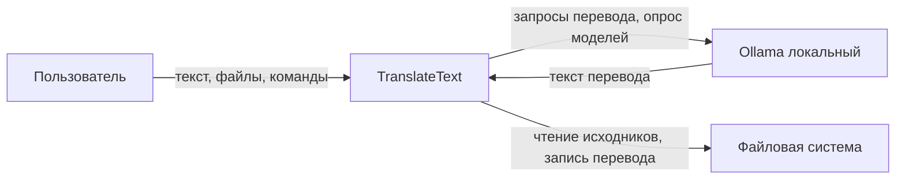

# ТЕХНИЧЕСКОЕ ЗАДАНИЕ

на создание автоматизированной системы «TranslateText»

---

**Заказчик:** владелец продукта (физическое лицо)

**Разработчик:** владелец продукта (физическое лицо)

**Вид автоматизированной системы:** система автоматизированного перевода текстовых материалов

**Объект автоматизации:** процесс перевода текстов и документов для личных нужд пользователя

**Сокращённое наименование АС:** TranslateText

**Обозначение документа:** ТЗ TranslateText.001

**Версия документа:** 1.2

**На** _____ **листах**

**Действует с** _______________

---

## 1. Общие сведения

### 1.1. Полное наименование системы и условное обозначение

| Параметр | Значение |
| --- | --- |
| Полное наименование | Автоматизированная система «TranslateText» |
| Условное обозначение | TranslateText |
| Версия минимально жизнеспособного продукта (MVP) | 1.0 |

### 1.2. Шифр темы или номер договора

Разработка осуществляется в рамках внутреннего проекта без заключения внешнего договора. Шифр темы: TranslateText-MVP.

### 1.3. Наименование заказчика и разработчика системы

| Роль | Наименование |
| --- | --- |
| Заказчик (пользователь) | Владелец продукта (физическое лицо) |
| Разработчик | Владелец продукта (физическое лицо) |

Заказчик и разработчик являются одним лицом. Реквизиты юридического лица не применяются.

### 1.4. Перечень документов, на основании которых создаётся система

| Обозначение документа | Дата утверждения / статус | Назначение |
| --- | --- | --- |
| Предварительное ТЗ (Specification.md) | исходная постановка | Исходные требования заказчика |
| Функциональные требования (A0125) | 2026-08-27, согласовано | Требования FT-001…FT-055 |
| Нефункциональные требования (A0127) | 2026-08-27, согласовано | Требования NFT-001…NFT-014 |
| Vision & Scope | 2026-08-31, v1.2 | Границы MVP |
| База закрытых ответов (Axxxx) | актуальная редакция | Уточнения требований заказчика |

При расхождении предварительного технического задания и согласованных требований приоритет имеют закрытые ответы Axxxx и согласованные пакеты функциональных и нефункциональных требований, пользовательских историй и сценариев использования.

### 1.5. Плановые сроки начала и окончания работ по созданию системы

| Этап | Плановый срок |
| --- | --- |
| Согласование требований | август 2026 г. (выполнено) |
| Разработка MVP по срезам | в соответствии с планом срезов MVP |
| Приёмка MVP | по завершении срезов и выполнении замера NFT-001 |

Окончательные календарные даты окончания работ подлежат уточнению и согласованию протоколом на стадии приёмки системы.

### 1.6. Сведения об источниках и порядке финансирования работ

Финансирование работ осуществляется за счёт собственных средств заказчика. Использование платных облачных сервисов перевода не предусматривается.

### 1.7. Порядок оформления и предъявления заказчику результатов работ

Техническая документация и исходный код подлежат размещению в репозитории проекта. Результаты работ по срезам MVP предъявляются заказчику в порядке, установленном планом срезов MVP. Утверждение глобальных этапов разработки оформляется записью в журнале состояния проекта после получения от заказчика решения об утверждении этапа.

Исполняемый модуль TranslateText.exe формируется локальной сборкой и в состав репозитория не включается.

---

## 2. Назначение и цели создания (развития) системы

### 2.1. Назначение системы

Автоматизированная система «TranslateText» предназначена для автоматизации процесса перевода больших объёмов текста, книг и документов между английским и русским языками (направления EN→RU и RU→EN) на персональном компьютере пользователя с привлечением локального программного комплекса Ollama.

Вид автоматизируемой деятельности: обработка текстовых материалов с использованием локального движка больших языковых моделей.

Объектами автоматизации являются:

- исходный текст (вводимый вручную либо извлекаемый из файла);
- параметры сеанса перевода (направление, системная инструкция, модель);
- очередь фрагментов и результат перевода;
- файлы исходного текста и перевода в файловой системе рабочей станции.

Система рассчитана на эксплуатацию одним пользователем за одним рабочим местом. Учётные записи, ролевая модель и многопользовательский режим в состав MVP не входят.

### 2.2. Цели создания системы

#### 2.2.1. Цели верхнего уровня

| Идентификатор | Формулировка цели | Критерий достижения |
| --- | --- | --- |
| BG-01 | Обеспечение перевода текстовых материалов без оплаты коммерческих API перевода | Выполнение перевода EN↔RU без облачных ключей и платной подписки |
| BG-02 | Обеспечение конфиденциальности переводимых материалов | Доля запросов с исходным текстом, направленных исключительно на локальный адрес Ollama, составляет 100 % (NFT-009) |

#### 2.2.2. Цели создания системы и требуемые значения показателей

| Идентификатор | Формулировка цели | Показатель и критерий оценки |
| --- | --- | --- |
| G-01 | Обеспечение локального перевода больших текстов EN↔RU | Выполнение перевода из окна приложения по команде «Перевести» (FT-009, FT-010) |
| G-02 | Обеспечение работы с файлами и ручным вводом | Поддержка импорта форматов .txt, .md, .docx, .pdf и экспорта .txt, .docx (FT-042, FT-046) |
| G-03 | Сокрытие от пользователя технологии нарезки текста | Автоматическое разбиение без участия пользователя (FT-015…FT-021) |
| G-04 | Индикация хода перевода длинного документа | Отображение индикатора прогресса в процентах при каждом запуске перевода (FT-022; NFT-005) |
| G-05 | Исключение передачи исходных данных за пределы локальной среды | Число запросов с телом исходного текста вне локального адреса Ollama равно нулю (NFT-009) |
| G-06 | Обеспечение приемлемой скорости перевода на целевом стенде | 95-й процентиль времени ответа на фрагмент 500–700 символов для модели qwen2.5:7b не превышает 60 с (NFT-001) |

Нормирование качества перевода по метрикам типа BLEU и сопоставимым методикам в состав настоящего технического задания не входит.

---

## 3. Характеристика объектов автоматизации

### 3.1. Краткие сведения об объекте автоматизации

Объектом автоматизации является процесс перевода текстовых материалов для личных нужд пользователя на персональном компьютере под управлением операционной системы Microsoft Windows.

До внедрения системы процесс перевода характеризуется следующими недостатками:

- использование облачных сервисов перевода, связанное с оплатой и передачей данных во внешние информационные системы;
- выполнение перевода длинных материалов в сторонних чат-интерфейсах без единого рабочего места «оригинал — перевод»;
- необходимость ручной нарезки текста и самостоятельного контроля хода перевода.

Детальное описание границ продукта приведено в документе Vision & Scope.

### 3.2. Сведения об условиях эксплуатации объекта автоматизации и характеристиках окружающей среды

| Параметр | Значение |
| --- | --- |
| Операционная система | Microsoft Windows (в составе MVP) |
| Средство отображения | Окно настольного приложения; веб-браузер не применяется |
| Способ запуска | Исполняемый модуль TranslateText.exe либо запуск из исходных текстов программы |
| Внешняя программная зависимость | Локальный сервис Ollama: http://127.0.0.1:11434, метод POST /api/chat |
| Сетевая среда | Передача исходного текста осуществляется только на адрес localhost; удалённый сетевой доступ к системе не предусматривается |
| Режим функционирования | Однопользовательский; непрерывность эксплуатации определяется инициативой пользователя |
| Климатические и механические условия | Стандартные условия эксплуатации персонального компьютера; специальные требования не устанавливаются |

### 3.3. Границы системы

В границах MVP входят: настольное приложение TranslateText; интеграция с локальным Ollama; чтение исходных файлов и запись файлов перевода посредством файловой системы операционной среды.

За границами MVP находятся: облачные и платные API перевода; собственный HTTP-сервер TranslateText; система управления базами данных; многопользовательский режим; автоматическое определение языка исходного текста; языковые пары, отличные от EN↔RU; мобильные и веб-клиенты; средства компьютерного-aided translation, память переводов и совместное редактирование.

---

## 4. Требования к системе

### 4.1. Требования к системе в целом

#### 4.1.1. Требования к структуре и функционированию системы

Система должна функционировать как локальное автономное настольное приложение без собственного серверного компонента, без системы управления базами данных и без обязательного подключения к сети Интернет для выполнения перевода.

Система должна обеспечивать единственный сеанс работы пользователя в одном экземпляре приложения.

Состав подсистем и их назначение:

| Подсистема | Назначение |
| --- | --- |
| Рабочее место пользователя | Отображение полей оригинала и перевода, настройка параметров, запуск и отмена перевода, индикация прогресса |
| Работа с файлами | Импорт исходного текста, экспорт результата перевода |
| Перевод и очередь фрагментов | Нарезка текста, формирование очереди, склейка результата, фиксация снимка настроек |
| Интеграция с Ollama | Опрос перечня моделей, направление запросов перевода на локальный адрес |

Структура системы является одноуровневой; централизация управления не требуется.

Связь компонентов системы должна обеспечиваться следующим образом: подсистема отображения — с прикладным слоем; прикладной слой — с Ollama по протоколу HTTP на localhost; прикладной слой — с файловой системой операционной среды через стандартные диалоги открытия и сохранения файлов.

Взаимодействие со смежными системами: локальный сервис Ollama (внешний движок перевода) — автоматический обмен по HTTP; файловая система Microsoft Windows — обмен через диалоги операционной среды.

Режимы функционирования системы:

| Режим | Описание |
| --- | --- |
| Ожидание (покой) | Редактирование исходного текста, настройка параметров, загрузка и сохранение файлов |
| Перевод | Выполнение очереди фрагментов; блокировка повторного запуска команды «Перевести» (FT-031) |
| Недоступность Ollama | Блокировка перевода; отображение сообщения о необходимости запуска сервиса (FT-024, FT-048) |

Диагностирование неисправностей должно осуществляться посредством сообщений в интерфейсе пользователя (FT-024, FT-028, FT-039, FT-044). Ведение отдельного журнала событий для пользователя в состав MVP не предусматривается (NFT-012).

Перспективы развития системы за пределами MVP: предупреждение при закрытии окна с несохранённым переводом; поддержка иных операционных систем; расширение перечня языковых пар.

#### 4.1.2. Требования к численности и квалификации персонала системы и режиму его работы

| Роль | Численность | Требования к квалификации | Режим работы |
| --- | --- | --- | --- |
| Пользователь | 1 | Владение навыками работы с файлами и графическим интерфейсом приложения; самостоятельная установка, запуск Ollama и загрузка языковых моделей | По инициативе пользователя |

Использование командной строки для выполнения основных операций перевода не предусматривается.

#### 4.1.3. Показатели назначения

| Идентификатор | Наименование показателя | Нормативное значение | Условия измерения |
| --- | --- | --- | --- |
| NFT-001 | 95-й процентиль времени ответа на фрагмент 500–700 символов | не более 60 с | Модель qwen2.5:7b; стенд: Ollama на GPU RTX 3060, Forge не запущен |
| NFT-002 | Задержка первой реакции интерфейса после старта перевода | не более 2 с | Без учёта ожидания Ollama и без диалогов FT-029, FT-032 |
| NFT-003 | Доля успешных опросов перечня моделей | 10 из 10 | При запущенном Ollama |
| NFT-005 | Точность индикатора прогресса | отклонение не более 1 % | После завершения каждого фрагмента |
| NFT-007 | Сохранность склейки при сбое или отмене | потеря символов равна нулю | FT-028, FT-054 |
| NFT-009 | Число запросов с исходным текстом вне localhost | 0 за сеанс | — |

Полный перечень показателей приведён в приложении Б. Правила измерения MR-01…MR-12 установлены в документе нефункциональных требований.

#### 4.1.4. Требования к надёжности

Система должна при сбое перевода очередного фрагмента либо при отмене перевода пользователем сохранять в поле перевода текст, полученный в результате обработки ранее успешно переведённых фрагментов (FT-028, FT-054, NFT-007).

Система должна при наличии несохранённого перевода запрашивать подтверждение пользователя перед выполнением команд «Перевести» или «Открыть файл» (FT-032, NFT-008).

Отсутствие ответа Ollama в течение более 120 с на один фрагмент должно классифицироваться как сбой очереди перевода (FT-028, MR-12, A0180).

Поведение системы в аварийных ситуациях:

| Событие | Требуемое поведение системы |
| --- | --- |
| Сбой запроса к Ollama | Остановка очереди; сохранение склейки успешных фрагментов; установка статуса «перевод не завершён» |
| Отмена пользователем | Остановка очереди без запуска следующего фрагмента; сохранение склейки (FT-054) |
| Сбой записи файла перевода | Сохранение текста в поле перевода; отображение сообщения об ошибке (FT-044) |
| Недоступность Ollama | Блокировка команды «Перевести»; отображение сообщения с указанием пути к start_ollama.bat (FT-024) |

#### 4.1.5. Требования безопасности

Требования по обеспечению безопасности при монтаже, наладке и эксплуатации технических средств (электробезопасность, электромагнитные поля, шум) на систему не распространяются, поскольку система представляет собой программное настольное приложение, эксплуатируемое на стандартном персональном компьютере. Риски причинения вреда жизни, здоровью, имуществу и окружающей среде в источниках разработки не регламентированы.

#### 4.1.6. Требования к эргономике и технической эстетике

Система должна применять канонические подписи элементов управления в соответствии с глоссарием проекта (NFT-006).

Система должна при блокировке команды «Перевести» отображать причину блокировки при наведении указателя на элемент управления (FT-050).

Система должна обеспечивать тёмную цветовую схему оформления интерфейса.

#### 4.1.7. Требования к транспортабельности

Требования к транспортабельности не устанавливаются. Система является стационарным настольным приложением. MVP ориентирован на операционную систему Microsoft Windows.

#### 4.1.8. Требования к эксплуатации, техническому обслуживанию, ремонту и хранению компонентов системы

Эксплуатация системы должна осуществляться путём запуска приложения и сервиса Ollama по мере необходимости пользователя. Техническое обслуживание включает обновление приложения, зависимостей среды Python и языковых моделей Ollama. Ведение отдельного журнала событий для пользователя не предусматривается (NFT-012).

#### 4.1.9. Требования к защите информации от несанкционированного доступа

Учётные записи и разграничение прав доступа в состав MVP не входят. Требования отраслевой нормативно-технической документации по защите от несанкционированного доступа на систему не распространяются.

#### 4.1.10. Требования по сохранности информации

Система должна обеспечивать сохранность уже полученного текста перевода при сбое обработки фрагмента, отмене очереди и сбое записи на носитель (FT-028, FT-044, FT-054, NFT-007).

Сохранность несохранённого перевода в оперативном состоянии сеанса при аварийном завершении приложения не гарантируется. Предупреждение при закрытии окна с несохранённым переводом относится к последующим релизам (A0166).

#### 4.1.11. Требования к средствам и способам защиты от влияния внешних воздействий

Специальные требования к радиоэлектронной защите и стойкости к климатическим воздействиям не устанавливаются. Эксплуатация осуществляется в стандартных условиях персонального компьютера.

#### 4.1.12. Требования к патентной чистоте

Система должна использовать открытые программные библиотеки языка Python и локальный сервис Ollama. Перечень стран, в отношении которых должна быть обеспечена патентная чистота, в источниках разработки не зафиксирован и подлежит уточнению при необходимости коммерческого распространения.

#### 4.1.13. Требования по стандартизации и унификации

Для оценки нефункциональных характеристик должна применяться модель качества ISO/IEC 25010:2023. Техническая документация проекта оформляется в формате Markdown. Терминология устанавливается глоссарием проекта.

#### 4.1.14. Дополнительные требования

Система должна направлять все запросы перевода исключительно на локальный адрес Ollama (FT-012, NFT-004).

Система не должна требовать наличия облачных ключей доступа (FT-013, NFT-010).

Исполняемый модуль TranslateText.exe должен формироваться средствами локальной сборки проекта.

### 4.2. Требования к функциям (задачам), выполняемым системой

Весь состав функций MVP подлежит вводу в действие в первой очереди. Детальная нумерация функциональных требований приведена в приложении А (FT-001…FT-055). Приоритет всех функций MVP — обязательный (Must).

Временной регламент: функции перевода должны выполняться последовательно в порядке очереди фрагментов; параллельная отправка фрагментов в Ollama не допускается (FT-019). Норматив времени ответа на фрагмент устанавливается требованием NFT-001.

#### 4.2.1. Функциональные возможности подсистемы «Рабочее место пользователя»

Система должна обеспечивать отображение поля «Оригинальный текст» для ввода исходного текста вручную либо для размещения текста, загруженного из файла (FT-001).

Система должна обеспечивать отображение единственного поля перевода с подписью «Русский перевод» при направлении EN→RU либо «Английский перевод» при направлении RU→EN; одновременное отображение двух полей результата не допускается (FT-002).

Система должна обеспечивать выбор направления перевода EN→RU или RU→EN посредством элемента «Направление перевода»; направление EN→RU должно устанавливаться по умолчанию при старте сеанса; автоматическое определение языка исходного текста не допускается (FT-051).

Система должна обеспечивать ввод и редактирование кастомной инструкции — системной инструкции для Ollama; до замены пользователем в поле должно отображаться значение базового промпта переводчика для текущего направления (FT-007, FT-008). При пустом значении инструкции и нажатии «Перевести» система должна запросить согласие на подстановку базового промпта либо отмену операции (FT-029).

Система должна обеспечивать отображение перечня «Модель» со всеми моделями, возвращаемыми локальным API Ollama, без фильтрации по наименованию; при старте сеанса должна выбираться модель qwen2.5:7b при её наличии в ответе API, в противном случае — первая модель ответа (FT-005, FT-006, FT-041, FT-045). Перечень моделей должен оставаться доступным для выбора при недоступности Ollama (FT-049).

Система должна обеспечивать запуск перевода по команде «Перевести» с переводом содержимого поля оригинала в соответствии с выбранным направлением и размещением результата в поле перевода (FT-009, FT-010).

Система должна обеспечивать отмену выполняемой очереди перевода по команде «Отменить перевод», отображаемой только на период выполнения перевода (FT-054).

Система должна обеспечивать отображение индикатора прогресса в процентах при каждом запуске перевода; доля обработанного текста должна соответствовать доле завершённых фрагментов (FT-022; NFT-005).

Система должна блокировать команду «Перевести» при пустом поле оригинала, при недоступности Ollama и на период выполнения перевода; при наведении указателя должна отображаться соответствующая подсказка (FT-026, FT-031, FT-048, FT-050). Система должна блокировать команду «Сохранить перевод» при пустом поле перевода (FT-027).

При смене направления перевода до запуска «Перевести» система должна сохранять текст поля перевода без изменений, не запускать перевод автоматически, не отображать предупреждение о несохранённом переводе; при совпадении текста инструкции с базовым промптом прежнего направления система должна подставить базовый промпт нового направления (FT-052, FT-053).

| Идентификатор | Критерий отказа функции |
| --- | --- |
| FT-029 | Пустая инструкция без согласия пользователя |
| FT-024 | Пустой перечень моделей при недоступности Ollama |
| FT-026, FT-048, FT-031 | Блокировка «Перевести» по условиям FT |

#### 4.2.2. Функциональные возможности подсистемы «Работа с файлами»

Система должна обеспечивать загрузку текста исходного файла в поле «Оригинальный текст» по команде «Открыть файл» для форматов .txt, .md, .docx и .pdf; в диалоге выбора файла должны предлагаться только указанные форматы (FT-003, FT-042).

Система должна обеспечивать экспорт содержимого поля перевода в файл формата .txt или .docx по команде «Сохранить перевод»; после успешной записи текущий перевод должен считаться сохранённым (FT-004, FT-046, FT-033).

При сохранении по пути существующего файла система должна следовать диалогу операционной среды «заменить / отмена»; при отмене существующий файл изменяться не должен (FT-043).

При невозможности извлечь текст из файла допустимого формата система должна отобразить соответствующее сообщение и не оставлять поле оригинала пустым без уведомления (FT-039).

При отмене диалога «Открыть файл» содержимое поля «Оригинальный текст» изменяться не должно (FT-047).

При сбое записи файла перевода система должна сохранить текст в поле перевода, отобразить сообщение об ошибке и не блокировать повторную команду «Сохранить перевод» (FT-044).

**Требование к импорту файлов объёмом более 100 000 символов (модель А):** система должна полностью загружать извлечённый текст в поле «Оригинальный текст» независимо от объёма; на этапе импорта обрезка текста, отказ в открытии файла и предупреждение о превышении лимита не допускаются. Отказ в выполнении перевода и отображение сообщения о превышении максимального объёма должны осуществляться исключительно в момент нажатия команды «Перевести» при объёме исходного текста более 100 000 символов Unicode; при этом текст обрезаться не должен (FT-014, FT-023; A0036).

#### 4.2.3. Функциональные возможности подсистемы «Перевод и очередь фрагментов»

Система должна автоматически разбивать исходный текст на фрагменты при его объёме, превышающем один фрагмент; целевой размер фрагмента должен составлять 500–700 символов Unicode, ни один фрагмент не должен превышать 700 символов; нарезка должна выполняться по границам предложений; при превышении единицей нарезки 700 символов разбиение должно выполняться по пробелам без разрыва слов (FT-015…FT-018, FT-025).

Текст объёмом не более 700 символов должен направляться на перевод одним фрагментом (FT-016).

Процесс нарезки не должен требовать действий со стороны пользователя (FT-021).

Система должна переводить фрагменты строго последовательно; направление в Ollama всего исходного текста одним запросом не допускается (FT-019).

Система должна склеивать переводы фрагментов в порядке исходного текста и отображать единый результат в поле перевода (FT-020).

На старте очереди система должна зафиксировать снимок кастомной инструкции, выбранной модели и направления перевода и применять данный снимок ко всем фрагментам данной очереди; изменение полей настроек до завершения очереди на запросы не влияет (FT-011).

В каждом запросе перевода фрагмента система должна передавать в роли пользовательского сообщения сырой текст фрагмента без служебных маркеров и короткий завершающий фрагмент инструкции в соответствии с FT-055.

Поле «Оригинальный текст» должно допускать содержание более 100 000 символов; вызов Ollama при объёме более 100 000 символов не допускается (FT-014). Объём исходного текста и фрагментов должен измеряться в символах Unicode (FT-030).

При новом запуске перевода система должна заменять содержимое поля перевода, не дописывая к предыдущему результату (FT-035).

При наличии несохранённого перевода система должна запрашивать подтверждение перед «Перевести» или «Открыть файл»; при отмене поля изменяться не должны (FT-032, FT-033).

При сбое запроса к Ollama, ошибке модели либо отсутствии ответа более 120 с система должна остановить очередь, сохранить склейку успешных фрагментов и установить статус «перевод не завершён»; результат не должен помечаться как полный перевод (FT-028).

#### 4.2.4. Функциональные возможности подсистемы «Интеграция с Ollama»

Система должна направлять запросы перевода исключительно на локальный адрес Ollama (FT-012).

Система должна выполнять перевод без облачных ключей и без платных внешних API перевода (FT-013).

При отсутствии ответа API либо при пустом перечне моделей система должна не начинать перевод, отображать сообщение о недоступности локального Ollama с указанием необходимости запуска файла start_ollama.bat в каталоге F:\Docker\Ollama; сообщение должно оставаться видимым до восстановления доступности; поле оригинала очищаться не должно (FT-024; NFT-011).

Система должна опрашивать локальный API перечня моделей при старте приложения и при каждом обращении к элементу «Модель»; выбранная модель не должна сбрасываться, если она присутствует в новом ответе API (FT-045).

### 4.3. Требования к видам обеспечения

#### 4.3.1. Требования к математическому обеспечению

Алгоритмы нарезки текста по границам предложений и расчёта доли прогресса (MR-08) должны реализовываться программными средствами. Выделение самостоятельных математических моделей не предусматривается.

#### 4.3.2. Требования к информационному обеспечению

Состав информационного обеспечения должен включать: оперативное состояние сеанса перевода; файлы исходного текста и перевода на носителе данных; языковые модели в среде Ollama. Применение системы управления базами данных не предусматривается.

Обмен данными между компонентами должен осуществляться: между подсистемой отображения и прикладным слоем; между прикладным слоем и Ollama по HTTP; между прикладным слоем и файловой системой через диалоги операционной среды.

Информационная совместимость должна обеспечивать импорт форматов .txt, .md, .docx, .pdf и экспорт .txt, .docx.

При сбоях очереди перевода и при сбое записи на носитель должна обеспечиваться сохранность уже полученных данных в соответствии с FT-028, FT-044, FT-054.

Постоянное хранение настроек сеанса после закрытия окна приложения не предусматривается. Восстановление данных возможно из ранее сохранённого файла перевода.

Детальная структура данных приведена в приложении Г.

#### 4.3.3. Требования к лингвистическому обеспечению

Язык интерфейса системы — русский. Переводимые тексты — английский и русский в соответствии с выбранным направлением. Автоматическое определение языка исходного текста не допускается (FT-051).

Средством взаимодействия пользователя с системой является графическое окно с полями ввода, элементами управления и диалогами операционной среды.

Тексты базовых промптов переводчика устанавливаются решениями A0006, A0122, A0143 (см. глоссарий).

#### 4.3.4. Требования к программному обеспечению

| Компонент | Технология |
| --- | --- |
| Язык реализации | Python 3 |
| Подсистема отображения | customtkinter |
| HTTP-клиент | httpx (только localhost Ollama) |
| Извлечение текста из файлов | python-docx, pypdf |
| Движок перевода | Ollama (локальный) |
| Средство тестирования | pytest |

Применение собственного HTTP-сервера, системы управления базами данных и облачных больших языковых моделей не предусматривается.

Архитектура программного обеспечения приведена в приложении Д.

#### 4.3.5. Требования к техническому обеспечению

| Компонент | Требование |
| --- | --- |
| Операционная система | Microsoft Windows |
| Рабочая станция | Персональный компьютер с ресурсами, достаточными для среды Python, Ollama и выбранной языковой модели |
| Графический процессор | Не является обязательным минимумом MVP; NVIDIA RTX 3060 12 ГБ является стендом измерения NFT-001 (A0161, A0028) |
| Сеть | Локальный доступ к адресу 127.0.0.1:11434 |

На период замера NFT-001 графический процессор должен быть отдан Ollama; параллельный запуск Forge на той же видеокарте не допускается (A0028).

#### 4.3.6. Требования к метрологическому обеспечению

Единицей измерения длины исходного текста и фрагментов должен являться символ Unicode (FT-030, MR-01).

Измерительные каналы: длина исходного текста; длина фрагмента; время ответа Ollama на фрагмент; процент выполнения перевода (MR-08).

Метрологическая аттестация системы не требуется; измерения носят прикладной характер для целей приёмки MVP.

#### 4.3.7. Требования к организационному обеспечению

Организационная структура подразделений не применяется. Взаимодействие осуществляется между пользователем, приложением TranslateText и сервисом Ollama. Установка и запуск Ollama выполняются пользователем самостоятельно.

Защита от ошибочных действий пользователя должна обеспечиваться диалогами подтверждения (FT-029, FT-032, FT-043), блокировкой элементов управления (FT-026, FT-027, FT-031, FT-048) и контекстными подсказками (FT-050).

#### 4.3.8. Требования к методическому обеспечению

| Документ | Назначение |
| --- | --- |
| Руководство по установке | Установка на ином персональном компьютере |
| Глоссарий проекта | Термины и канонические подписи интерфейса |
| Входной документ проекта (README) | Общие сведения о продукте и порядке запуска |

---

## 5. Состав и содержание работ по созданию системы

Работы по созданию системы должны выполняться в соответствии со стадиями жизненного цикла, установленными планом срезов MVP. Исполнителем всех работ является разработчик (заказчик).

| Стадия (этап) | Содержание работ | Результат |
| --- | --- | --- |
| 1. Формирование требований | Разработка и согласование ФТ, НФТ, US, UC, доменной модели, словаря данных | Согласованный пакет требований |
| 2. Проектирование | Проектирование интерфейса, прикладного слоя, доменной модели | Проектные решения, диаграммы |
| 3. Реализация | Выполнение срезов MVP S-01…S-13 | Рабочая версия приложения |
| 4. Тестирование | Автоматизированное и ручное тестирование | Отчёт о тестировании, карта покрытия |
| 5. Замер производительности | Выполнение замера NFT-001 на целевом стенде | Отчёт о замере производительности |
| 6. Сборка | Формирование исполняемого модуля | TranslateText.exe |
| 7. Ввод в действие | Установка Ollama и приложения | Руководство по установке |

По окончании соответствующих стадий должны предъявляться: настоящее техническое задание; пакет требований; отчёты о тестировании и замере; исходные тексты программы.

---

## 6. Порядок контроля и приёмки системы

### 6.1. Виды, состав, объём и методы испытаний

| Вид испытаний | Объект | Метод |
| --- | --- | --- |
| Модульные и интеграционные | Подсистема отображения и прикладной слой | Автоматизированные тесты pytest |
| Приёмочные | Соответствие критериям успеха MVP | Ручная проверка по критериям Vision & Scope и таблицам ФТ/НФТ |
| Замер производительности | Показатель NFT-001 | Замер на стенде RTX 3060 по методике отчёта NFT-001 |

### 6.2. Общие требования к приёмке работ

Минимально жизнеспособный продукт считается принятым при одновременном выполнении следующих условий:

- система обеспечивает перевод EN→RU и RU→EN из окна приложения (FT-051, FT-010);
- система выполняет автоматическую нарезку длинного текста в пределах лимита 100 000 символов на один вызов Ollama (FT-015…FT-020);
- система полностью импортирует файл объёмом более 100 000 символов и отказывает в переводе только при нажатии «Перевести» (модель А; A0036);
- система корректно обрабатывает недоступность Ollama (FT-024, FT-048; NFT-011);
- система запрашивает подтверждение при несохранённом переводе (FT-032);
- система обеспечивает отмену очереди перевода (FT-054);
- система обеспечивает сохранение перевода в форматах .txt и .docx (FT-004, FT-046);
- на стенде измерения выполняется норма NFT-001;
- подписи элементов управления соответствуют глоссарию (NFT-006);
- первая реакция интерфейса после старта перевода не превышает 2 с (NFT-002).

### 6.3. Порядок согласования и утверждения приёмочной документации

Приёмку осуществляет заказчик на основании результатов испытаний и отчётной документации. Статус приёмочной комиссии: внутренняя (единственный заказчик). Оформление результатов приёмки — запись в журнале состояния проекта либо протокол приёмки.

---

## 7. Требования к составу и содержанию работ по подготовке объекта автоматизации к вводу системы в действие

| № | Мероприятие | Исполнитель |
| --- | --- | --- |
| 1 | Установка операционной системы Microsoft Windows | Пользователь |
| 2 | Установка среды Python с поддержкой tcl/tk (при запуске из исходных текстов) | Пользователь |
| 3 | Установка и запуск Ollama; загрузка языковых моделей (рекомендуется qwen2.5:7b) | Пользователь |
| 4 | Установка приложения TranslateText | Пользователь |
| 5 | Проверка доступности Ollama по адресу http://127.0.0.1:11434 | Пользователь |
| 6 | Ознакомление с руководством по установке | Пользователь |

Изменения организационной структуры и методов управления объекта автоматизации не требуются. Создание подразделений и комплектование штатов не применимо. Обучение пользователя осуществляется самостоятельно по входному документу проекта и руководству по установке.

---

## 8. Требования к документированию

### 8.1. Перечень подлежащих разработке комплектов и видов документов

| Документ | Назначение |
| --- | --- |
| Техническое задание (настоящий документ) | Требования к автоматизированной системе |
| Функциональные требования | Детализация FT-001…FT-055 |
| Нефункциональные требования | Детализация NFT-001…NFT-014 |
| Доменная модель | Описание предметной области |
| Словарь данных | Контракт данных |
| Глоссарий | Терминология и подписи интерфейса |
| Vision & Scope | Границы MVP |
| Руководство по установке | Эксплуатация на ином ПК |
| Отчёт о тестировании | Результаты автотестов |
| Отчёт о замере NFT-001 | Результаты замера производительности |

### 8.2. Требования к оформлению документации

Техническая документация должна оформляться в формате Markdown в системе контроля версий Git. Диаграммы должны представляться в текстовых форматах (Mermaid, PlantUML, BPMN). Структура исходных текстов программы должна соответствовать описанию структуры проекта.

---

## 9. Источники разработки

| Источник | Содержание |
| --- | --- |
| Предварительное техническое задание | Исходная постановка задачи |
| Описание среды Ollama | Адрес API, контейнер, модель |
| База закрытых ответов A0001–A0176 | Уточнения требований |
| Функциональные требования FT-001…FT-055 | Детализация функций |
| Нефункциональные требования NFT-001…NFT-014 | Детализация качества |
| Пользовательские истории US-001…US-010 | Потребности пользователя |
| Сценарии использования UC-001…UC-010 | Сценарии эксплуатации |
| Доменная модель | Инварианты предметной области |
| Словарь данных | Атрибуты и ограничения данных |
| Vision & Scope | Границы MVP |
| Конфигурация проекта | Стек и интеграции |
| План срезов MVP | Порядок поставки |

---

## Приложение А. Перечень функциональных требований

Полный перечень требований FT-001…FT-055 приведён в документе функциональных требований проекта.

Снятые номера (автосохранение, отменено A0096): FT-034, FT-036, FT-037, FT-038, FT-040.

---

## Приложение Б. Перечень нефункциональных требований

Полный перечень требований NFT-001…NFT-014 и правила измерения MR-01…MR-12 приведены в документе нефункциональных требований проекта.

---

## Приложение В. Термины и определения

| Термин | Определение |
| --- | --- |
| TranslateText | Локальное настольное приложение для перевода больших объёмов текста между английским и русским языками |
| Ollama | Локальный программный комплекс больших языковых моделей на рабочей станции пользователя |
| Фрагмент | Часть исходного текста, направляемая на перевод одним запросом к Ollama; целевой объём 500–700 символов, не более 700 |
| Очередь фрагментов | Упорядоченная последовательность фрагментов одного запуска команды «Перевести» |
| Кастомная инструкция | Системная инструкция для Ollama, определяющая стиль и правила перевода |
| Несохранённый перевод | Состояние поля перевода при наличии текста, не зафиксированного командой «Сохранить перевод» после последнего изменения |
| Локальный адрес Ollama | http://127.0.0.1:11434 |
| Стенд измерения перевода | Конфигурация: Ollama на GPU RTX 3060; Forge на данной видеокарте не запущен |

Полный перечень терминов — глоссарий проекта.

---

## Приложение Г. Структура данных

### Г.1. Общие положения

Применение системы управления базами данных не предусматривается. Данные размещаются в оперативном состоянии сеанса, на носителе данных файловой системы и в среде Ollama.

Контракт данных и доменная модель приведены в соответствующих документах требований (A0139, A0138).

### Г.2. Реестр объектов данных

| Объект | Вид | Назначение |
| --- | --- | --- |
| Workspace | Сущность (корень агрегата) | Состояние сеанса перевода |
| QueueState | Объект-значение | Очередь фрагментов текущего запуска |
| QueueSnapshot | Объект-значение | Снимок инструкции, модели и направления |
| Fragment | Объект-значение | Фрагмент исходного текста |
| SourceText | Объект-значение | Исходный текст |
| TranslationText | Объект-значение | Текст перевода |
| TranslationDirection | Объект-значение | Направление EN→RU / RU→EN |
| ModelName | Объект-значение | Наименование модели Ollama |

### Г.3. Атрибуты агрегата сеанса перевода (Workspace)

| Атрибут | Тип | Ограничения |
| --- | --- | --- |
| originalText | SourceText | Символы Unicode; поле допускает более 100 000 символов; вызов Ollama при более 100 000 запрещён (FT-014, FT-023) |
| translationText | TranslationText | Склейка фрагментов либо полный перевод |
| direction | TranslationDirection | EN→RU (по умолчанию) или RU→EN |
| customInstruction | строка | Базовый промпт по умолчанию |
| selectedModel | ModelName | Из ответа API; по умолчанию qwen2.5:7b (FT-041) |
| translationSaved | логический | Признак сохранённости перевода (FT-033) |
| queue | QueueState | Не более одной активной очереди |

### Г.4. Ограничения на данные

| Ограничение | Значение |
| --- | --- |
| Максимальный объём на один вызов Ollama | 100 000 символов Unicode |
| Размер фрагмента | Целевой 500–700; максимум 700 |
| Единица измерения длины | Символ Unicode |
| Таймаут ответа на фрагмент | 120 с |

---

## Приложение Д. Архитектура системы

### Д.1. Слои программной архитектуры

| Слой | Назначение |
| --- | --- |
| Представление | Графическое окно настольного приложения |
| Сценарии использования | Координация операций пользователя |
| Службы | Взаимодействие с Ollama, нарезка текста, работа с файлами |
| Предметная область | Модели данных и правила домена |

### Д.2. Внешние интерфейсы

| Внешняя система | Протокол / способ | Назначение |
| --- | --- | --- |
| Ollama | HTTP, 127.0.0.1:11434, POST /api/chat | Перевод, получение перечня моделей |
| Файловая система ОС | Диалоги Windows | Импорт .txt, .md, .docx, .pdf; экспорт .txt, .docx |

### Д.3. Последовательность обработки при переводе

1. Пользователь инициирует команду «Перевести».
2. Система проверяет предусловия: наличие оригинала, соблюдение лимита объёма, доступность Ollama, состояние сохранённости перевода, наличие инструкции.
3. Система фиксирует снимок настроек очереди.
4. Система выполняет нарезку исходного текста на фрагменты.
5. Система последовательно направляет запросы к Ollama.
6. Система склеивает результаты в поле перевода и обновляет индикатор прогресса.
7. По завершении, сбою или отмене система устанавливает статус очереди.

---

## Приложение Е. Схема взаимодействия компонентов

---

## Приложение Ж. История изменений документа

| Версия | Дата | Описание изменений |
| --- | --- | --- |
| 1.0 | 31.08.2026 | Первоначальная версия по пакету требований MVP |
| 1.1 | 31.08.2026 | Структура по ГОСТ 34.602-89 (разделы 1–9); исправления по аудиту |
| 1.2 | 31.08.2026 | Приведение формулировок к официально-техническому стилю ГОСТ; развёрнутое описание функциональных возможностей в §4.2 |

---

**СОСТАВИЛИ**

| Должность | Подпись | Дата |
| --- | --- | --- |
| Системный аналитик | | 31.08.2026 |

**СОГЛАСОВАНО**

| Должность | Подпись | Дата |
| --- | --- | --- |
| Заказчик | | |
