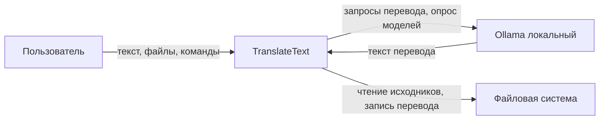

# Vision & Scope — TranslateText

Документ о концепции и границах проекта.

| Поле | Значение |
| --- | --- |
| Продукт | TranslateText |
| Версия документа | 1.2 |
| Дата | 2026-08-31 |
| Статус | Согласован с пакетом требований MVP (`A0125`, `A0127`, `A0132`, `A0126`, `A0138`, `A0139`) |
| Аудитория | Заказчик, аналитик, архитектор, разработчики, тестировщик |

---

## 1. Назначение документа

Этот документ фиксирует **зачем** создаётся TranslateText, **какую проблему** он решает, **какое видение** у продукта и **где проходят границы** первого релиза (MVP). Он служит входной точкой для детальных требований в `requirements/` и не дублирует таблицы ФТ/НФТ.

Документ предназначен для согласования scope до и во время разработки. При конфликте с детальными требованиями приоритет у закрытых ответов `Axxxx` и согласованных пакетов ФТ/НФТ/US/UC.

---

## 2. Связанные документы

| Документ | Роль |
| --- | --- |
| `documentation/Specification.md` | Предварительное ТЗ (UI, Ollama, нарезка, прогресс) |
| `requirements/functional-requirements.md` | Детальные функциональные требования (`A0125`) |
| `requirements/non-functional-requirements.md` | Нефункциональные требования (`A0127`) |
| `requirements/user-stories/` | Пользовательские истории (`A0132`) |
| `requirements/use-cases/` | Сценарии использования (`A0126`) |
| `requirements/glossary.md` | Терминология (`A0128`) |
| `requirements/domain-model.md` | Доменная модель (`A0138`) |
| `requirements/answers-project.md` | Закрытые решения `Axxxx` |
| `reports/project-config.md` | Стек и интеграции |
| `reports/checklist.md` | Порядок срезов MVP |

---

## 3. Краткое резюме

TranslateText — **локальное бесплатное** десктоп-приложение на Python для перевода больших объёмов текста, книг и документов **между английским и русским** (EN→RU и RU→EN). Перевод выполняется через **локальный Ollama** (семейство моделей Qwen2.5); облачные API и платные сервисы не требуются. Пользователь работает в окне приложения (customtkinter): открывает или вставляет текст, настраивает инструкцию и модель, запускает перевод с автоматической нарезкой на фрагменты и индикатором прогресса, сохраняет результат в файл.

MVP ориентирован на **одного пользователя** за одним ПК под Windows с установленным Ollama.

---

## 4. Предыстория

В предварительном ТЗ (`documentation/Specification.md`) сформулирована потребность в минималистичном инструменте для перевода длинных текстов с английского на русский с использованием локального движка Ollama на машине с GPU NVIDIA RTX 3060. Изначально в ТЗ упоминались Gradio или Streamlit; в ходе уточнений каноном UI MVP стал **customtkinter** — отдельное окно приложения, не браузер (`A0173`).

Пакет требований MVP согласован: добавлено направление RU→EN (`A0119`–`A0124`), отмена перевода в очереди (`A0146`–`A0158`), уточнены размер фрагмента (500–700 символов, `A0160`), защита от «выполнения заданий» из исходника (`A0143`–`A0145`, FT-055). Разработка ведётся срезами по `reports/checklist.md`.

---

## 5. Проблема и бизнес-возможность

### 5.1. Проблема

Перевод больших текстов и документов через облачные сервисы связан с оплатой, передачей данных во внешние системы и ограничениями на объём запроса. Ручной перевод книг и длинных материалов в сторонних чат-интерфейсах неудобен: нет единого рабочего места «оригинал — перевод», нет прозрачной работы с файлами, нет управляемой нарезки длинного текста и индикации прогресса.

### 5.2. Возможность

На рабочей машине уже доступен локальный Ollama с моделями семейства Qwen2.5 и GPU, которую можно отдать переводу на время работы приложения (`A0161`, `A0028`). Это позволяет сделать **бесплатный локальный** перевод больших документов без облачных ключей, с контролем стиля через кастомную инструкцию и выбором модели из локального списка.

---

## 6. Цели проекта

### 6.1. Бизнес-цели (Business Goals)

Верхнеуровневые цели стейкхолдера (заказчик и разработчик — одно лицо, `AS-06`). Продуктовые цели в §6.2 служат средством их достижения.

| ID | Бизнес-цель | Измеримость / срок | Источник |
| --- | --- | --- | --- |
| BG-01 | **Снизить затраты** на оплату коммерческих API перевода (DeepL, OpenAI и аналоги) до **0 ₽** для личных нужд перевода больших текстов и документов | Регулярный перевод EN↔RU без облачных ключей и без подписки; целевой горизонт — **к концу 2026 года** | `Specification.md` («полностью бесплатно»); FT-013; NFT-010; `A0001` |
| BG-02 | **Обеспечить конфиденциальность** переводимых материалов: исключить утечку исходного текста и кастомной инструкции в облачные сервисы | **100 %** запросов перевода с телом исходного текста уходят только на локальный адрес Ollama за сеанс (NFT-009); обязательных облачных ключей = 0 (NFT-010) | FT-012, FT-013; NFT-004, NFT-009 |

### 6.2. Цели продукта (Product Goals)

Что должно делать приложение для реализации бизнес-целей BG-01 и BG-02.

| ID | Цель | Связь с BG | Источник |
| --- | --- | --- | --- |
| G-01 | Дать пользователю простой инструмент перевода больших текстов EN↔RU локально и бесплатно | BG-01 | `Specification.md`; `A0001` |
| G-02 | Обеспечить работу с файлами `.txt`, `.md`, `.docx`, `.pdf` и ручным вводом | BG-01, BG-02 | `Specification.md`; FT-042 |
| G-03 | Скрыть от пользователя техническую нарезку длинного текста на фрагменты и очередь запросов к Ollama | BG-01 | `Specification.md`; `A0004`; FT-021 |
| G-04 | Показать прогресс перевода длинного документа | BG-01 | `Specification.md`; FT-022 |
| G-05 | Не отправлять исходный текст и инструкции за пределы локального Ollama | BG-02 | FT-012, FT-013; NFT-009 |
| G-06 | Достичь приемлемой скорости перевода на целевом стенде (p95 ≤ 60 с на фрагмент 500–700 символов для `qwen2.5:3b`) | BG-01 | NFT-001; `A0161` |

---

## 7. Критерии успеха

MVP считается успешным, если выполняются условия ниже. Детальные метрики — в НФТ; здесь — уровень продукта.

| Критерий | Проверка |
| --- | --- |
| Пользователь переводит текст EN→RU и RU→EN из окна приложения одной кнопкой «Перевести» | US-001, US-009; FT-051, FT-010 |
| Длинный текст (до 100 000 символов для вызова Ollama) переводится по фрагментам без ручной нарезки | FT-015…FT-020; `A0160` |
| При недоступном Ollama пользователь понимает, что делать (запуск `start_ollama.bat`) | FT-024; NFT-011 |
| Несохранённый перевод не теряется молча при повторном «Перевести» или «Открыть файл» | FT-032; US-006 |
| Пользователь может отменить идущую очередь перевода | FT-054; US-010 |
| Перевод сохраняется в `.txt` или `.docx` | FT-004, FT-046 |
| На стенде измерения NFT-001 p95 времени ответа на фрагмент 500–700 символов ≤ 60 с | NFT-001; `reports/nft-001-measurement.md` |
| Приложение запускается на Windows без облачных ключей | NFT-010; `A0025` |

Качество перевода «как у профессионального переводчика» в источниках **не нормируется** (нет методики BLEU и т.п.) — это осознанное ограничение scope.

---

## 8. Потребности пользователей

### 8.1. Профиль пользователя (User Profile)

| Атрибут | Описание |
| --- | --- |
| Роль | **Пользователь** — единственная человеческая роль (`A0002`); учёток, ролей «админ / гость» и многопользовательского режима нет |
| Контекст | Владелец ПК с локальным Ollama; переводит книги, статьи и документы для **личных** нужд (заказчик = разработчик, `AS-06`) |
| Интерфейс TranslateText | **No-code** для основного сценария: окно с кнопками и полями, диалоги «Открыть файл» / «Сохранить перевод», выбор модели и направления. **Консоль для ежедневной работы в приложении не требуется** |
| Инфраструктура вне приложения | **Повышенная техническая грамотность обязательна:** пользователь сам устанавливает и запускает Ollama, при необходимости — через Docker или `start_ollama.bat` (`A0008`, `AS-01`); **самостоятельно скачивает модели** в Ollama (`AS-02`); приложение только опрашивает API и показывает список. Без работающего Ollama и хотя бы одной модели перевод недоступен (FT-024, FT-048) |
| Ожидания от UX | Понятные подписи глоссария (NFT-006); при сбоях — сообщения в интерфейсе, а не «тихий» отказ; инструкция по установке на другом ПК — `reports/instruction.md` |
| Вне компетенции профиля | Администрирование серверов, настройка сетевого прокси, разработка промптов на уровне API — не целевой навык; CAT, вычитка и оценка качества перевода «как у профессионала» — вне scope |

Профиль используется при проектировании UI (`/ui-prototyping`, `/frontend`): в окне TranslateText не предполагается терминал, но сообщения о недоступности Ollama могут ссылаться на путь к `start_ollama.bat` (FT-024, NFT-011).

### 8.2. Потребности пользователя

| Потребность | Как закрывает продукт |
| --- | --- |
| Быстро начать перевод вставленного или загруженного текста | Поля «Оригинальный текст» и поле перевода; кнопка «Перевести» |
| Выбрать направление EN→RU или RU→EN явно | Элемент «Направление перевода»; без автоопределения языка |
| Задать стиль перевода (технический, художественный, юридический и т.д.) | Поле «Кастомная инструкция» и базовый промпт по направлению |
| Выбрать подходящую модель Ollama | Список «Модель» из локального API |
| Понимать ход перевода длинного документа | Индикатор прогресса в процентах |
| Не потерять уже полученный перевод при сбое или отмене | Склейка успешных фрагментов; предупреждение о несохранённом переводе |
| Сохранить результат в файл | «Сохранить перевод» |
| Понять, почему «Перевести» недоступна | Подсказки по наведению (FT-050) и сообщение о недоступности Ollama (FT-024) |
| Остановить долгий перевод | Команда «Отменить перевод» |

---

## 9. Видение решения

**Для** пользователя, которому нужно переводить большие тексты и документы между английским и русским **без оплаты и без отправки данных в облако**,

**TranslateText** — это **локальное десктоп-приложение**,

**которое** принимает исходный текст или файл, переводит его через локальный Ollama по настраиваемой инструкции, автоматически обрабатывает длинные материалы фрагментами и показывает прогресс,

**в отличие от** облачных переводчиков и ручной работы в чат-интерфейсах

**наш продукт** держит весь цикл «оригинал — перевод — сохранение» в одном окне, работает только с локальным Ollama и не требует API-ключей.

Видение **не включает** собственный сервер TranslateText, многопользовательский режим, CAT-инструменты и автоопределение языка исходного текста.

---

## 10. Ключевые возможности (Major Features)

Сгруппированный обзор возможностей MVP. Детализация — в ФТ.

| Группа | Возможности | Ориентиры |
| --- | --- | --- |
| Рабочее место | Два поля рядом: оригинал и перевод; выбор направления EN→RU / RU→EN | FT-001, FT-002, FT-051 |
| Файлы | Открытие `.txt`, `.md`, `.docx`, `.pdf` — **весь** извлечённый текст в «Оригинальный текст» (без обрезки на этапе импорта); сохранение `.txt`, `.docx` | FT-003, FT-042, FT-004, FT-046; §12.1 |
| Настройка перевода | Кастомная инструкция, базовый промпт, выбор модели Ollama | FT-007…FT-008, FT-005, FT-006, FT-041, FT-045 |
| Перевод | Запуск очереди фрагментов, снимок настроек на старт, склейка результата | FT-009…FT-011, FT-019, FT-020, FT-055 |
| Длинный текст | Нарезка 500–700 символов по границам предложений; лимит **100 000 символов на вызов Ollama** (не на вместимость поля и не на импорт файла) | FT-015…FT-018, FT-025, FT-014, FT-023, `A0160`, `A0036` |
| Обратная связь | Прогресс в %; блокировка «Перевести» с подсказками; сообщение о недоступности Ollama | FT-022, FT-031, FT-048, FT-050, FT-024 |
| Защита данных пользователя | Только локальный адрес Ollama; без облачных ключей | FT-012, FT-013; NFT-004, NFT-009 |
| Надёжность сеанса | Предупреждение о несохранённом переводе; остановка при сбое фрагмента; отмена очереди | FT-032, FT-028, FT-054 |

---

## 11. Область проекта (Scope)

### 11.1. Включено в MVP (первый релиз)

- Локальное окно приложения на **customtkinter** под **Windows** (`A0173`, `A0025`).
- Направления перевода **EN→RU** (по умолчанию) и **RU→EN** (`A0119`, `A0120`).
- Интеграция только с **локальным Ollama** (`http://127.0.0.1:11434`, `POST /api/chat`).
- Список всех моделей из ответа API; модель по умолчанию `qwen2.5:3b` при наличии (`A0045`).
- Автоматическое разбиение на фрагменты и перевод по очереди.
- Индикатор прогресса при каждом запуске «Перевести».
- Команда «Отменить перевод» во время очереди (`A0146`).
- Десять пользовательских историй US-001…US-010 и соответствующие UC-001…UC-010.
- Сборка исполняемого файла `TranslateText.exe` для запуска без Python (локальная сборка, в git не хранится).
- Автотесты pytest на поверхности desktop/customtkinter.

### 11.2. Последующие релизы (post-MVP, не в текущем scope)

Зафиксировано в разделах «Вне MVP» ФТ и НФТ; планирование отдельно:

- Предупреждение при закрытии окна с несохранённым переводом (`A0166`).
- Файл журнала для пользователя (`A0027`).
- Автосохранение в папку `output` — **отменено** (`A0096`), не планируется в текущей ветке.
- Поддержка ОС, кроме Windows (`A0025`).
- Другие языковые пары и автоопределение языка (`A0119`, `A0044`).
- CAT, память переводов, совместное редактирование, вычитка.
- Собственный HTTP-сервер TranslateText и OpenAPI-контракт продукта.
- Нормирование «адаптивности» UI по пикселям и брейкпоинтам (`A0026`).
- Автоопрос моделей при возврате фокуса в окно без клика по «Модель» (`A0079`).

### 11.3. Явно исключено (Out of scope)

| Исключение | Обоснование |
| --- | --- |
| Облачные и платные API перевода | `A0001`; локальный бесплатный перевод |
| Учётки, роли, многопользовательский режим | `A0002` |
| Определение языка исходного текста | `A0044`; `A0119` |
| Пайплайн Stable Diffusion / Forge из `other-description.md` | Не относится к переводу текстов |
| Gradio и Streamlit как UI MVP | `A0173` |
| Одновременная нагрузка TranslateText и Forge на одной GPU при замере скорости | `A0028` |
| Качество перевода как метрика приёмки (BLEU и т.п.) | Нет методики в источниках |
| Мобильные клиенты и веб-версия продукта | Desktop-only MVP |

---

## 12. Ограничения

| Ограничение | Описание |
| --- | --- |
| Платформа | MVP только Windows (`A0025`) |
| Движок | Только локальный Ollama; другой LLM-backend не предусмотрен |
| Объём | Лимит **100 000 символов Unicode** на один запуск «Перевести» (вызов Ollama), **не** на импорт файла и **не** на вместимость поля (`A0005`, `A0007`, `A0036`; MR-05) |
| Фрагмент | Не длиннее 700 символов Unicode; целевой диапазон 500–700 (`A0160`) |
| Языки | Только EN↔RU; третьи языки вне MVP |
| UI | Окно customtkinter; не браузер, не сайт (`A0173`) |
| Архитектура | Нет своего серверного бэкенда, СУБД, FastAPI/Flask (`reports/project-config.md`) |
| Производительность | Норма NFT-001 только для `qwen2.5:3b` на стенде GPU RTX 3060 без параллельного Forge (`A0043`, `A0161`) |
| Таймаут | Отсутствие ответа Ollama дольше 60 с на фрагмент — сбой очереди (FT-028, MR-12) |

### 12.1. Критерии исключения и поведение при нарушении ограничений

Явное поведение системы при выходе за границы ограничений (приёмка — соответствующие ФТ).

#### Решение по лимиту 100 000 символов и файлам (.pdf, .docx и др.)

При открытии крупного файла возможны две модели; в MVP закреплена **только первая**:

| Модель | Поведение | Статус в MVP |
| --- | --- | --- |
| **А. Импорт целиком, отказ при «Перевести»** | `ExtractSource` / «Открыть файл» извлекает **весь** текст и помещает в «Оригинальный текст», даже если объём > 100 000. Кнопка «Перевести» **не блокируется** только из‑за объёма. При нажатии «Перевести» — отказ, сообщение, Ollama не вызывается, текст **не обрезается** | **Канон** (`A0036`, FT-003, FT-014, FT-023) |
| **Б. Превентивная обрезка или отказ при импорте** | Прерывание чтения на 100 000-м символе, молчаливая обрезка или запрет открыть «слишком большой» файл | **Вне scope** — противоречит FT-023 («не обрезать молча») и FT-003 (загрузить текст файла в поле) |

Ограничение 100 000 символов относится к **вызову Ollama** (один запуск «Перевести»), а не к вместимости поля и не к этапу парсинга файла (глоссарий; MR-05; `data-dictionary.md`).

| Ограничение | Условие нарушения | Поведение системы (критерий исключения) | Источник |
| --- | --- | --- | --- |
| Импорт исходного файла при объёме > 100 000 | Пользователь открыл `.txt`, `.md`, `.docx` или `.pdf`; извлечённый текст **длиннее** 100 000 символов Unicode | Система **полностью** загружает извлечённый текст в «Оригинальный текст» для просмотра и редактирования; перевод **автоматически не стартует**; на этапе импорта **нет** обрезки, **нет** отказа «файл слишком большой» и **нет** предупреждения о лимите (если только это не отдельное UX-решение post-MVP). Отказ и сообщение — **только** в момент «Перевести» (см. следующая строка) | FT-003, FT-042; FT-014; `A0036`; UC-001 [Шаг 1.2], UC-009 [Шаг 1.2] |
| Объём исходного текста (100 000 символов) | Объём в поле «Оригинальный текст» **больше** 100 000 символов Unicode (вставка вручную **или** после загрузки файла) и Пользователь нажимает «Перевести» | Перевод **не начинается**; Ollama **не вызывается**; показывается сообщение о превышении максимального объёма; текст **не обрезается** молча; приложение **не завершается** и **не зависает** | FT-023; `A0007`; `A0036` |
| Объём (до нажатия «Перевести») | Поле содержит более 100 000 символов, но «Перевести» ещё не нажата | Поле **может** содержать больший объём; Ollama **не вызывается** до «Перевести»; кнопка «Перевести» **не блокируется** только из‑за превышения лимита (если оригинал непуст и Ollama доступна) | FT-014; `A0036` |
| Недоступный Ollama | Нет ответа API или список моделей пуст | «Перевести» заблокирована; постоянное сообщение с путём к `start_ollama.bat`; поле оригинала не очищается | FT-024, FT-048 |
| Пустой оригинал | Поле «Оригинальный текст» пусто | «Перевести» заблокирована; подсказка по наведению «Нет текста для перевода» | FT-026, FT-050 |
| Сбой фрагмента / таймаут 60 с | Ошибка модели или нет ответа дольше 60 с на фрагмент | Очередь останавливается; в поле перевода остаётся склейка успешных фрагментов; результат **не** помечается как полный | FT-028; MR-12 |

---

## 13. Допущения

| ID | Допущение |
| --- | --- |
| AS-01 | На машине пользователя установлен и может быть запущен Ollama (Docker-контейнер `ollama_local` или эквивалент) |
| AS-02 | Пользователь самостоятельно скачивает нужные модели в Ollama; приложение только показывает список из API |
| AS-03 | Для целевой скорости на время перевода GPU отдаётся Ollama, Forge не работает параллельно на той же карте (`A0028`) |
| AS-04 | Путь запуска Ollama на этой машине: `F:\Docker\Ollama\start_ollama.bat` (`A0008`) — приёмка MVP |
| AS-05 | Пользователь понимает выбранное направление перевода; система язык не определяет |
| AS-06 | Заказчик и разработчик — одно лицо; отдельный процесс согласования с внешним заказчиком не моделируется |
| AS-07 | Python с tcl/tk доступен при запуске из исходников (`README`) |

---

## 14. Зависимости

| Зависимость | Тип | Влияние |
| --- | --- | --- |
| Ollama (локальный API) | Внешняя runtime-система | Без Ollama перевод невозможен; FT-024, FT-048 |
| Модели в Ollama (например `qwen2.5:3b`) | Контент/конфигурация | Скорость и качество перевода зависят от модели |
| NVIDIA GPU RTX 3060 (целевой стенд) | Инфраструктура | Норма NFT-001 измеряется на этом стенде |
| Библиотеки Python | Технические | `customtkinter`, `httpx`, `python-docx`, `pypdf` (`src/requirements.txt`) |
| Файловая система ОС | Платформа | Чтение исходных файлов и запись перевода |
| Согласованный пакет требований | Процесс | ФТ, НФТ, US, UC, DDD, словарь данных — канон разработки |

---

## 15. Риски

| Риск | Вероятность / влияние | Митигация в scope MVP |
| --- | --- | --- |
| Ollama не запущен или список моделей пуст | Высокая / блокирует перевод | Сообщение FT-024, блокировка FT-048, подсказка FT-050 |
| Модель «выполняет задания» из исходника вместо перевода | Средняя / качество | Усиление базового промпта A0143; хвост user-сообщения A0145; FT-055 |
| Медленный перевод при занятой GPU или другой модели | Средняя / UX | Стенд и норма NFT-001 зафиксированы; предупреждение при смене модели не вводится (`A0043`) |
| Потеря несохранённого перевода | Средняя / данные пользователя | FT-032, FT-033; не распространяется на закрытие окна (`A0166`) |
| Сбой на середине очереди | Средняя / неполный результат | FT-028: сохранить склейку, показать незавершённость |
| Невозможность извлечь текст из PDF/DOCX | Низкая / пустое поле | FT-039: явное сообщение |
| Конкуренция за GPU с Forge | Средняя / скорость | Режим «либо перевод, либо Forge» (`A0028`) |

---

## 16. Стейкхолдеры

| Стейкхолдер | Интерес | Участие в MVP |
| --- | --- | --- |
| Пользователь | Перевести и сохранить текст локально и бесплатно; конфиденциальность данных (BG-02) | Primary; профиль — §8.1 |
| Заказчик / разработчик | Рабочий MVP по согласованным требованиям | Владелец решений `Axxxx`; приёмка срезов |
| Ollama | Выполнение запросов перевода | Внешняя система; не актор US |
| Cursor MAS (роли analyst, architect, developer, tester) | Поставка артефактов и кода | Процесс разработки; не предметная роль продукта |

---

## 17. Приоритеты проекта

Все пользовательские истории MVP имеют приоритет **Must** (MoSCoW). Функциональные требования FT-001…FT-055 — **Must** в таблице ФТ.

При конфликте ресурсов (время GPU, сроки срезов) приоритеты:

1. Корректность границ scope и трассируемость к ФТ/НФТ.
2. Happy path перевода одного и нескольких фрагментов (S-04, S-07 в `checklist.md`).
3. Обработка недоступности Ollama и блокировок UI.
4. Файловые форматы и диалоги сохранения.
5. Замер NFT-001 на целевом стенде (S-13).

Выбор Gradio/Streamlit **не является** предметом приоритизации — решение закрыто в пользу customtkinter (`A0173`).

---

## 18. Среда эксплуатации

| Аспект | Значение |
| --- | --- |
| ОС | Windows (MVP) |
| UI | Окно customtkinter, тёмная тема «студия» |
| Запуск | `artifacts/TranslateText.exe` или `src/run-ui.bat` / `python app.py` |
| Ollama | `http://127.0.0.1:11434`; пример контейнера `ollama_local` |
| Целевое железо (стенд) | NVIDIA RTX 3060 12 ГБ; Ollama на GPU для перевода |
| Сеть | Исходный текст уходит только на localhost Ollama (NFT-004, NFT-009) |
| Установка на другом ПК | Инструкция `reports/instruction.md` (Ollama без Docker) |

### Контекст системы (граница решения)

Вне границы: облачные LLM, собственный сервер TranslateText, Stable Diffusion / Forge, другие пользователи по сети.

---

## 19. Связь с артефактами требований

| Раздел Vision & Scope | Детализация |
| --- | --- |
| Ключевые возможности | `requirements/functional-requirements.md` (FT-001…FT-055) |
| Критерии успеха (нефункциональные) | `requirements/non-functional-requirements.md` (NFT-001…NFT-014) |
| Потребности пользователей | `requirements/user-stories/` (US-001…US-010) |
| Сценарии | `requirements/use-cases/` (UC-001…UC-010) |
| Термины | `requirements/glossary.md` |
| Поведение и инварианты | `requirements/domain-model.md`, `requirements/data-dictionary.md` |
| Решения заказчика | `requirements/answers-project.md` |
| Порядок поставки | `reports/checklist.md` |
| Прогресс реализации | `reports/traceability.md`, `reports/pm-state.md` |

Документ Vision & Scope **не заменяет** ФТ/НФТ при приёмке функций; при расхождении детали уточняются в требованиях и `Axxxx`.

---

## 20. История изменений

| Версия | Дата | Автор | Изменения |
| --- | --- | --- | --- |
| 1.2 | 2026-08-31 | Системный аналитик | Явно зафиксирована модель **А** (полный импорт файла, отказ при «Перевести»); модель **Б** (обрезка при парсинге) — вне scope; §10, §12, §12.1 |
| 1.1 | 2026-08-31 | Системный аналитик | Бизнес-цели BG-01…BG-02 (§6.1); профиль пользователя (§8.1); критерии исключения при ограничениях (§12.1) |
| 1.0 | 2026-08-31 | Системный аналитик (по пакету требований) | Первоначальная версия по согласованному MVP EN↔RU, Ollama, customtkinter |
