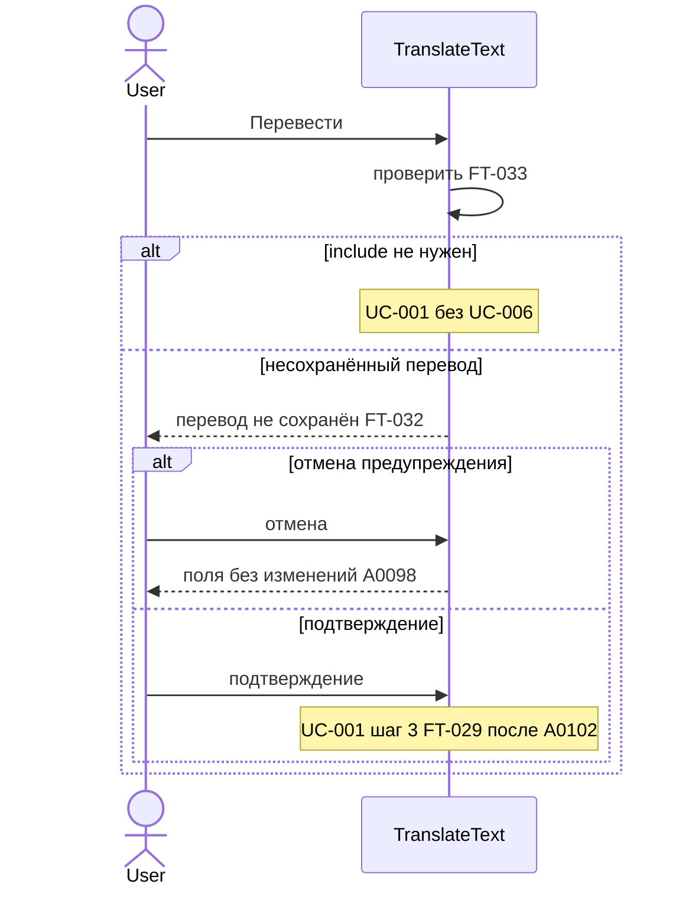
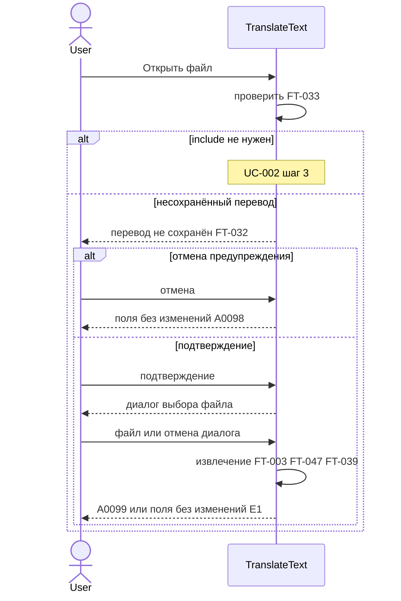

# Sequence: предупреждение о несохранённом переводе (UC-006)

**Тип:** sequenceDiagram  
**Статус:** Черновик, требует согласования  
**ID файла:** `diagram-mermaid-001`

## Источники

- `requirements/use-cases/uc-006-unsaved-translation-warning.md` (основной поток, §5.1–§5.6, E1–E2)
- `requirements/use-cases/uc-001-translate-text.md` (include шаг 2; порядок FT-032 → FT-029, `A0102`)
- `requirements/use-cases/uc-002-open-file.md` (include шаг 2; шаги 3–6 после подтверждения)
- `requirements/functional-requirements.md`: FT-032, FT-033, FT-003, FT-035, FT-039, FT-047
- `requirements/glossary.md`: Пользователь, TranslateText, несохранённый перевод
- `requirements/answers-project.md`: `A0096`–`A0100`, `A0102`

## Граница процесса

**Входит:** include UC-006 при «Перевести» (UC-001) и «Открыть файл» (UC-002); проверка FT-033; диалог FT-032; отмена (поля не меняются, `A0098`); подтверждение и возврат к вызывающему UC; для «Открыть файл» — исходы UC-002 после подтверждения (очистка перевода `A0099`, отмена диалога FT-047, сбой извлечения FT-039 E1).

**Не входит:** очередь перевода и `POST /api/chat` (UC-001, отдельная диаграмма — backlog); согласование пустой инструкции FT-029 (UC-005, после UC-006 при «Перевести», `A0102`); опрос моделей (см. `diagram-mermaid-002.md`); ручное «Сохранить перевод» (UC-003).

Предусловие happy path: TranslateText открыто; в «Русский перевод» несохранённый перевод (UC-006 §2).

## Участники

| Id | Нотация | Откуда |
| --- | --- | --- |
| User | actor Пользователь | UC-006, глоссарий |
| TranslateText | participant (приложение / UI) | глоссарий; в UC — «система» |

Ollama и автосохранение в `output` — вне границы UC-006; извлечение текста — самовызов TranslateText (FT-003).

## Основной поток (цепочка)

Два include из UC-001 и UC-002 — **отдельные** диаграммы (§4.6.4: не более двух уровней `alt`).

### Include из UC-001 («Перевести»)

1. Пользователь → TranslateText: «Перевести».
2. TranslateText проверяет FT-033. Если include не нужен ([Шаг 1.1]) — UC-001 продолжается без диалога.
3. Иначе TranslateText → Пользователь: предупреждение FT-032.
4. Отмена → поля без изменений, перевод не начат ([Шаг 3.1], `A0098`).
5. Подтверждение → возврат к UC-001 шаг 3; при пустой инструкции затем FT-029 (`A0102`).

### Include из UC-002 («Открыть файл»)

1. Пользователь → TranslateText: «Открыть файл».
2. Проверка FT-033; при отсутствии несохранённого — UC-002 шаг 3 без предупреждения.
3. Иначе предупреждение FT-032 → подтверждение или отмена.
4. После подтверждения: выбор файла, извлечение (FT-003); успех — оригинал обновлён, «Русский перевод» очищен (`A0099`); отмена диалога — FT-047; сбой извлечения — FT-039 E1, поля на месте.

## Ветки `alt` / `else` (из источника)

| Ветка | Исход | Реакция UI |
| --- | --- | --- |
| перевод сохранён или поле пусто | FT-032, FT-033 [1.1] | include не выполняется |
| отмена предупреждения | A0098 [3.1] | поля без изменений |
| подтверждение «Перевести» | FT-035, A0102 | UC-001 продолжается |
| подтверждение «Открыть файл», успех | A0099 | оригинал обновлён, перевод очищен |
| отмена диалога файла | FT-047 [5.1] | поля без изменений |
| текст не извлечён | FT-039 E1 | сообщение; перевод не очищен |
| неполный перевод после FT-028 | A0097 [1.2] | считается несохранённым → шаг 2 |

## Проверка §4.6

- 4.6.1 да: очереди перевода нет; критический сбой очереди не моделируется.
- 4.6.2 да: нет дублирующих запросов к внешним participant.
- 4.6.3 да: нет стрелок к Ollama/output/ФС; извлечение — `TT->>TT`.
- 4.6.4 да: в каждой диаграмме ровно два уровня `alt`; исходы загрузки файла — в таблице, не третий `alt`; две диаграммы; `==` нет.
- 4.6.5 да: долгих действий вне UI нет.
- 4.6.6 да: не применимо (нет loop).
- 4.6.7 да: диаграмма 1 — `alt` 2 + `end` 2; диаграмма 2 — `alt` 2 + `end` 2; итого `alt` 4, `end` 4 (`else` своего `end` не даёт).

### Include из UC-001

### Include из UC-002

## Замечания

- Неполный перевод после сбоя фрагмента (FT-028) попадает в FT-033 и запускает include ([Шаг 1.2]).
- После подтверждения «Перевести» новый результат заменяет правое поле (FT-035 [5.2]), не дописывается.
- Исходы загрузки файла после подтверждения (успех `A0099`, отмена FT-047, сбой FT-039) — в таблице веток; на схеме UC-002 — одно сообщение с исходом, без третьего уровня `alt`.
- Очередь перевода — UC-001; отдельная sequence-диаграмма не в этом файле.

Проверено: участники из UC/глоссария; actor vs participant; команды Пользователя; ответы UI; §4.6.1–§4.6.7; два блока Mermaid с `end` = 4; без Ollama и автосохранения.
