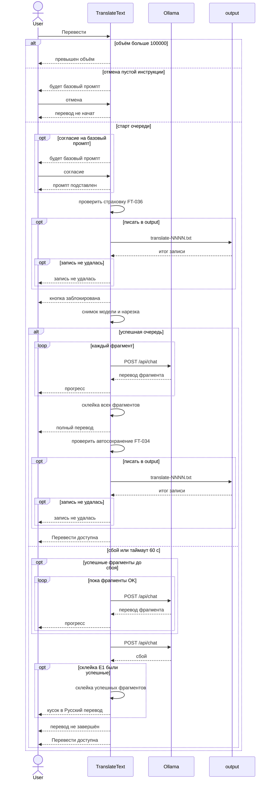

# Sequence: перевод фрагментов, автосохранение, сбой очереди

**Тип:** sequenceDiagram  
**Статус:** Черновик, требует согласования  
**ID файла:** `diagram-mermaid-001`

## Источники

- `requirements/use-cases/uc-001-translate-text.md` (основной поток, [Шаг 1.2], [Шаг 1.3], [Шаг 4.1], E2)
- `requirements/use-cases/uc-006-autosave.md` (include до замены и после полного перевода)
- `requirements/use-cases/uc-007-ollama-unavailable.md` (E1 / E2: сбой фрагмента, таймаут 60 с)
- `requirements/functional-requirements.md`: FT-011, FT-016…FT-022, FT-023, FT-028, FT-029, FT-031, FT-034…FT-037, FT-040, FT-035
- `requirements/glossary.md`: Пользователь, TranslateText, Ollama, фрагмент, индикатор прогресса, автосохранение, папка output; `POST /api/chat` на локальный адрес Ollama

## Граница процесса

**Входит:** команда «Перевести» при непустом оригинале; пустая кастомная инструкция (FT-029); лимит 100 000; include UC-006; снимок модели и инструкции; очередь фрагментов к Ollama; индикатор прогресса; склейка полного или частичного перевода; сбой очередного фрагмента (UC-007 E1/E2).

**Не входит:** открытие файла (UC-002); опрос списка «Модель» и восстановление после запуска Ollama (см. `diagram-mermaid-002.md`); подсказки UC-008; ручное «Сохранить перевод» (UC-003); отмена очереди Пользователем (вне MVP, A0044); пустой оригинал (FT-026: команды «Перевести» нет).

Предусловие happy path: TranslateText открыто, оригинал не пуст, Ollama доступна, модель выбрана (UC-001 §2).

## Участники

| Id | Нотация | Откуда |
| --- | --- | --- |
| User | actor Пользователь | UC-001, глоссарий |
| TranslateText | participant (приложение / UI) | глоссарий; в UC — «система» |
| Ollama | participant | UC-001 supporting; POST /api/chat |
| output | participant папка output | UC-006, FT-037 |

Слоёв Frontend / API TranslateText / БД нет: своего HTTP-сервера приложения в источниках нет.

## Основной поток (цепочка)

Порядок как в UC-001: [Шаг 1.2] и [Шаг 1.3] — до шага 2; include UC-006 и блокировка — шаг 2; нарезка — шаг 3; очередь — шаг 4.

1. Пользователь → TranslateText: «Перевести» (UC-001 шаг 1).
2. При непустом «Русский перевод» — include UC-006 (страховка до замены, FT-036) после внутренней проверки галочки и A0035.
3. TranslateText → Пользователь: блокировка «Перевести», индикатор прогресса без ожидания ответа Ollama (FT-031, NFT-002). Снимок модели и инструкции (FT-011). Нарезка без участия Пользователя (FT-015…FT-018, FT-021).
4. Для каждого фрагмента: TranslateText → Ollama: `POST /api/chat`; ответ → прогресс (FT-019, FT-022).
5. Склейка всех фрагментов в «Русский перевод» (FT-020, FT-035), include UC-006 (FT-034), разблокировка «Перевести».
6. Ветка сбоя (не продолжение успешного loop): свой отрезок успешных POST, сбойный POST, склейка уже успешных только в `opt` (E1); при E2 склейки нет, правое поле не перезаписывается; «перевод не завершён»; разблокировка. FT-034 в этой ветке нет.

## Ветки `alt` / `else` (из источника)

| Ветка | Исход | Реакция UI |
| --- | --- | --- |
| объём больше 100 000 | FT-023, UC-001 [Шаг 1.2] | превышен объём; Ollama не вызывается |
| кастомная инструкция пуста, отмена | FT-029 | перевод не начат, поле пусто |
| кастомная инструкция пуста, согласие | A0050 | базовый промпт в поле, далее очередь |
| автосохранение выключено или полный перевод уже записан | A0020, A0035 | в `output` не писать (на схему не рисуется) |
| запись `output` не удалась | FT-040 | поля на месте; показать сбой записи |
| все фрагменты успешны | FT-020, FT-035, FT-034 | полный перевод, запись при включённой галочке, кнопка доступна |
| сбой после части успеха (E1) | FT-028, UC-007 E1 | очередь стоп; склейка уже успешных; «перевод не завершён» |
| сбой на первом фрагменте (E2) | FT-028, UC-007 E2 | очередь стоп; склеивать нечего; правое поле не перезаписывается; «перевод не завершён» |

HTTP-коды ответа Ollama в UC не заданы — ветки по исходам UC, без выдуманных 2xx/4xx.

Подписи на схеме короткие. Полные формулировки — в таблице и в основном потоке.

## Проверка §4.6

- 4.6.1 да: сбой очереди — `else` верхнего `alt` очереди, не внутри `loop`. Успешный loop только в ветке без сбоя.
- 4.6.2 да: у ветки сбоя свой `opt`/`loop` и свой сбойный POST, не хвост успешной очереди.
- 4.6.3 да: перед `output` самовызов FT-036 / FT-034; запись только в `opt`; нет `else` «не писать» к папке.
- 4.6.4 да: `alt` два уровня (отклонение до очереди → успех/сбой очереди). `==` нет. Вложенный `alt` закрыт своим `end` до внешнего.
- 4.6.5 да: долгого действия вне UI нет.
- 4.6.6 да: склейка части — `opt склейка E1`; при 0 успешных фрагментов (E2) правое поле не трогаем.
- 4.6.7 да: `alt` 2 + `opt` 7 + `loop` 2 = 11 открытий; `end` 11. `else` своего `end` не даёт.

## Замечания

- Повторное «Перевести» во время очереди (FT-031): кнопка уже заблокирована; подсказка — UC-008, на схему не вынесена.
- Нарезка сверхдлинного абзаца (FT-025) — правило внутри шага нарезки, без отдельного участника.
- Папка `output` — не актор UC-006; participant как место записи FT-037.

Проверено: участники только из UC/глоссария; actor vs participant; команды на «Перевести» и на диалоге FT-029; ответы UI к Пользователю; §4.6.1–§4.6.7 закрыты до Mermaid, `end` = 11; POST /api/chat только для фрагмента; без выдуманных HTTP-кодов; граница без UC-004 и без восстановления Docker.
