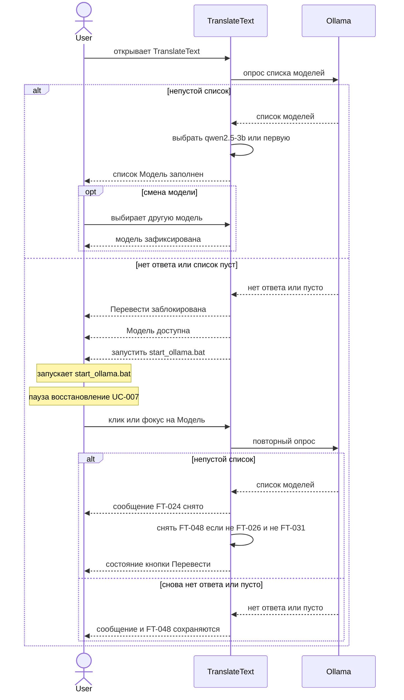

# Sequence: опрос моделей при старте и восстановление Ollama

**Тип:** sequenceDiagram  
**Статус:** Черновик, требует согласования  
**ID файла:** `diagram-mermaid-002`

## Источники

- `requirements/use-cases/uc-004-select-model.md` (основной поток, [Шаг 2.1], [Шаг 4.1], [Шаг 5.1], E1)
- `requirements/use-cases/uc-007-ollama-unavailable.md` (основной поток шаги 1–6, [Шаг 6.1])
- `requirements/functional-requirements.md`: FT-005, FT-024, FT-041, FT-045, FT-048, FT-049
- `requirements/glossary.md`: Пользователь, TranslateText, Ollama, Модель, локальный адрес Ollama
- `A0078`, `A0079`, `A0045`, `A0053`, `A0055`

## Граница процесса

**Входит:** открытие TranslateText; опрос локального API моделей (старт, клик или фокус на «Модель»); заполнение списка и выбор по умолчанию; отказ API / пустой список; блокировка «Перевести» при живом списке «Модель»; сообщение `start_ollama.bat` в `F:\Docker\Ollama`; повторный опрос после запуска Ollama Пользователем; снятие сообщения и блокировки FT-048.

**Не входит:** include UC-006 (см. `diagram-mermaid-001.md`); подсказки UC-008; смена модели на уже идущую очередь (снимок FT-011 не разворачивается). Очередь перевода и `POST /api/chat` — UC-001 (отдельная sequence-диаграмма — backlog).

Метод опроса **списка** моделей в источниках — «локальный API», без path в глоссарии. На схеме: «опрос списка моделей», без выдуманного URL.

Пользователь запускает Ollama файлом `start_ollama.bat` сам: Docker не участник UC.

## Участники

| Id | Нотация | Откуда |
| --- | --- | --- |
| User | actor Пользователь | UC-004, UC-007 |
| TranslateText | participant | система / UI |
| Ollama | participant | supporting, локальный API моделей |

## Основной поток (цепочка)

1. Пользователь → TranslateText: открывает приложение (UC-004 шаг 1).
2. TranslateText → Ollama: опрос списка моделей (FT-045). Вызов безусловный при старте — самопроверка флага перед опросом не требуется (§4.6.3).
3. Непустой ответ: список «Модель» без фильтра (FT-005); выбор `qwen2.5:3b` или первой модели (FT-041) — внутренняя проверка TranslateText.
4. Пользователь при необходимости выбирает другую модель (UC-004 шаг 6).

## Восстановление (UC-007)

1. Нет ответа или пустой список: «Перевести» заблокирована (FT-048), «Модель» доступна (FT-049), сообщение FT-024, оригинал не очищать.
2. Пользователь запускает `start_ollama.bat` вне UI (асинхронная пауза).
3. Новое действие в интерфейсе: клик или фокус на «Модель». Повторный опрос (FT-045). Непустой список: снять FT-024; снять FT-048, если не действуют FT-026 и FT-031 (A0079).

## Ветки `alt` / `else`

| Ветка | Исход | Реакция UI |
| --- | --- | --- |
| непустой список, есть qwen2.5:3b | FT-041 | эта модель выбрана |
| непустой список, нет qwen2.5:3b | A0045 | выбрана первая модель ответа |
| нет ответа API или список пуст | FT-024, FT-048, FT-049 | серая «Перевести», живая «Модель», текст про bat |
| повторный опрос непустой, оригинал пуст | UC-007 [Шаг 6.1] | FT-048 снята, «Перевести» серая по FT-026 |
| повторный опрос непустой, идёт перевод | A0079, FT-031 | FT-048 снята, «Перевести» серая до конца или обрыва очереди |
| повторный опрос непустой, можно переводить | A0079 | «Перевести» доступна |
| повторный опрос снова пуст / нет ответа | A0079 | сообщение и FT-048 остаются |
| выбранная модель ещё в новом списке | A0053 | выбор не сбрасывать |
| выбранной модели нет, список не пуст | A0053 | снова FT-041 |

HTTP-коды не заданы — без 2xx/4xx.

Подписи короткие. Три исхода кнопки после успешного повторного опроса — в таблице; на схеме одно самосообщение TranslateText.

## Проверка §4.6

- 4.6.1 да: очередь перевода не входит. Исход «список есть / нет API» — верхний `alt`. Повторный опрос — второй `alt` внутри `else`, не внутри `loop`.
- 4.6.2 да: повторный опрос целиком в `else` первого опроса, не хвост успешного заполнения списка.
- 4.6.3 да: опрос при старте безусловен (FT-045). Выбор модели и снятие FT-048 — самовызовы TranslateText.
- 4.6.4 да: `alt` два уровня. `==` нет (пауза — `Note`). Вложенный `alt` закрыт своим `end`, затем внешний `end`.
- 4.6.5 да: запуск bat — `Note over User`; пауза UC-007 — вторая `Note`; возобновление — клик или фокус на «Модель».
- 4.6.6 да: цикла фрагментов перевода нет; правило нулевых итераций к этой схеме не применяется.
- 4.6.7 да: `alt` 2 + `opt` 1 + `loop` 0 = 3 открытия; `end` 3.

## Замечания

- Шаг 7 UC-004 (снимок модели в очереди) относится к UC-001, здесь не разворачивается.
- Повторный опрос при уже живом списке ([Шаг 4.1] UC-004): та же пара «клик/фокус → опрос»; A0053 — в таблице веток, без второго `loop`.
- Автоопрос при возврате фокуса в окно без клика по «Модель» вне MVP (A0079).
- В подписи Mermaid имя модели — `qwen2.5-3b`: двоеточие в `alt` ломает превью; в источниках — `qwen2.5:3b`.
- Восстановление остаётся в `else` первого опроса, чтобы успешный старт не продолжался UC-007.

Проверено: участники только Пользователь, TranslateText, Ollama; actor vs participant; команды на открытии, смене модели и повторном клике/фокусе; §4.6.1–§4.6.7 закрыты до Mermaid, `end` = 3; без выдуманных HTTP и без URL списка моделей; восстановление без перезапуска приложения (A0079).
