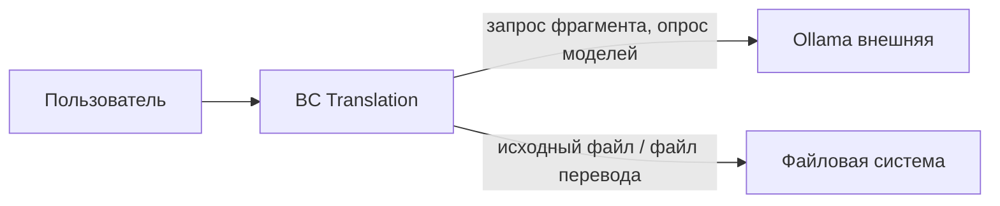

# Доменная модель TranslateText

Статус: **Согласовано** (`A0138`); актуализировано 2026-08-30 (FT-054 / FT-055, `A0164`–`A0165`, `A0173`–`A0176`).  
Дата: 2026-08-27  
Назначение: ограниченные контексты, агрегаты, сущности, объекты-значения и инварианты для MVP локального перевода EN→RU и RU→EN.

Источники: `documentation/Specification.md`, `requirements/glossary.md` (`A0128`), `requirements/functional-requirements.md` (`A0125`), `requirements/non-functional-requirements.md` (только доменные правила, `A0127`; NFT-014 — `A0129`), `requirements/user-stories/`, `requirements/use-cases/`, `requirements/answers-project.md` (`A0001`–`A0176`). Соглашение об именах — `A0073`. Граница BC — `A0074`. Базис очереди — `A0076`. Предупреждение о несохранённом переводе — `A0096`–`A0100`. Порядок UC-006 и FT-029 — `A0102`. Направление перевода и поле перевода — `A0119`–`A0124`, `A0129`, `A0131`. Отмена очереди — `A0146`–`A0153`, `A0158`, `A0164`, `A0165` / FT-054. Базовый промпт — `A0143`, `A0162`. User-сообщение фрагмента — `A0163` / FT-055. Предыдущее согласование модели EN→RU — `A0116` (расширено и пересогласовано `A0138`). Критичные правки после аудита: `reports/domain-model-review.md` (§4 перенесён, 2026-08-27).

## Соглашение об именах

Описания и инварианты — на языке глоссария (русский).

Идентификаторы типов и атрибутов в таблицах — английский PascalCase / camelCase (1–2 слова) (`A0073`).

| Термин глоссария | Идентификатор |
| --- | --- |
| TranslateText (сеанс приложения) | `Workspace` |
| Очередь фрагментов текущего запуска «Перевести» | `QueueState` |
| Оригинальный текст | `originalText` / VO `SourceText` |
| Поле перевода | `translationText` / VO `TranslationText` |
| Русский перевод | подпись UI правого поля при `direction = EN→RU` (не отдельный атрибут) |
| Английский перевод | подпись UI правого поля при `direction = RU→EN` (не отдельный атрибут) |
| Направление перевода | `direction` / VO `TranslationDirection` |
| Кастомная инструкция | `customInstruction` |
| Базовый промпт переводчика | литерал A0006+A0143 (EN→RU) или A0122+A0143 (RU→EN) в поле `customInstruction` |
| Модель Ollama | `ModelName` |
| Фрагмент | `Fragment` |
| User-сообщение фрагмента | сборка в `OllamaGateway` (FT-055), не атрибут Workspace |
| Разбиение на фрагменты | служба `SplitText` |
| Несохранённый перевод | правило FT-033: непустой `translationText` без успешного «Сохранить перевод» с последнего изменения поля; флаг `translationSaved` |
| Символ (для лимитов) | измерение длины Unicode, не тип |
| Пользователь | не сущность (нет учётки, A0002) |
| Ollama | внешняя система, не агрегат этого BC |
| Очередь выполняется | `inProgress` |
| Полный перевод очереди | `completed` |
| Перевод не завершён | `incomplete` (FT-028 или FT-054) |

Не смешивать: **очередь фрагментов** (`QueueState`) и **флаг сохранённости перевода** (`translationSaved` после успешного `ExportTranslation`); **направление сеанса** (`direction`) и **снимок направления очереди** (`QueueSnapshot.direction`).

## Карта ограниченных контекстов

Один Core-контекст (`A0074`). Язык один: исходный текст, фрагменты, снимок инструкции, модели и направления, склейка, предупреждение о несохранённом переводе. Ollama — внешняя система за антикоррупционным слоем, не второй BC. Отдельный BC «файлы» не выделен: исходный файл и файл перевода — команды к тому же сеансу.

| BC | Subdomain | Зачем |
| --- | --- | --- |
| Translation | Core | Основной процесс: перевести текст локально фрагментами по выбранному направлению и не потерять результат |

Между контекстами своих Entity нет. На границу с Ollama уходят: текст фрагмента; снимок инструкции, модели и направления (`QueueSnapshot`, FT-011, A0129); обратно — текст перевода фрагмента или отказ. Идентификатор модели — строка имени из ответа API, не общий класс с Ollama. Содержание промпта в снимке отражает пару языков выбранного направления.

## Доменные службы

| Служба | Что делает | Чего не делает |
| --- | --- | --- |
| `SplitText` | Нарезает `SourceText` на список `Fragment` по FT-015…FT-018, FT-025, A0160, A0142 | Не вызывает Ollama; не пишет файлы; не зависит от направления |
| `ExtractSource` | Извлекает текст из исходного файла допустимого формата после предусловия UC-006 при «Открыть файл» | Не стартует перевод (FT-003, FT-039); не показывает диалоги |
| `StartTranslation` | Предусловие UC-006 и FT-029; координация старта очереди: снимок (инструкция, модель, направление), нарезка, запрет второго запуска | Не держит GPU-нормы НФТ; не показывает диалоги |
| `ExportTranslation` | Пишет выбранный Пользователем файл перевода (FT-004); после успеха помечает перевод сохранённым (`translationSaved`) | Не очищает поля сеанса |
| `OllamaGateway` | Антикоррупционный слой: опрос списка моделей; перевод одного фрагмента на локальный адрес; сборка user-сообщения по FT-055 | Не хранит оригинал; не пишет файлы перевода без команды Пользователя |

## Вне MVP

- Учётки и несколько сеансов (A0002).
- Другие пары языков, кроме EN→RU и RU→EN (A0119); определение языка исходного текста (A0044, A0119).
- Облачный перевод, свой HTTP-сервер TranslateText.
- Память прошлых переводов, CAT, вычитка.
- Журнальный файл для Пользователя (A0027).
- Автосохранение (FT-034…FT-040) — отменено (`A0096`).
- Предупреждение при закрытии окна с несохранённым переводом (`A0166`).
- Отдельный литерал статуса «отменено» (очередь после отмены — `incomplete`, A0150).

Пороги NFT-001 / NFT-002 (секунды до UI, p95 GPU) — не инварианты домена. Условие сбоя «нет ответа дольше 120 с» входит в FT-028 / A0031 / A0180 — это правило обрыва очереди, не норма производительности.

---

## Translation

Сеанс TranslateText: поля оригинала и перевода, направление, кастомная инструкция, выбранная модель, текущая очередь фрагментов, флаг сохранённости перевода.

### Агрегат: Workspace

Единственная точка входа в оперативное состояние сеанса. Поля и текущая очередь меняются согласованно: нельзя начать вторую очередь, пока первая не закончилась или не оборвалась (FT-031); снимок модели, инструкции и направления фиксируется на старте этой очереди (FT-011, A0052, A0120); полный или неполный перевод в поле перевода и предупреждение о несохранённом переводе относятся к тому же сеансу (FT-028, FT-032, FT-033, FT-054).

Учётки нет: идентичность корня — единственный сеанс запущенного приложения (A0002), не личность и не хранимый UUID.

#### 1. Сущности (Entities)

| Сущность | Атрибут | Тип данных (Бизнес) | Обязательность | Правила / Валидация | Описание |
| :--- | :--- | :--- | :--- | :--- | :--- |
| Workspace (корень) | originalText | VO SourceText | да (может быть пустым) | Длина — символы Unicode (FT-030). Поле может быть длиннее 100 000; вызов Ollama при длине > 100 000 запрещён (FT-014, FT-023) | Канон: «Оригинальный текст» |
| Workspace | translationText | VO TranslationText | да (может быть пустым) | Единственное хранимое представление текущего текста поля перевода: в ходе очереди — склейка завершённых фрагментов; после успеха — полный перевод (замена, не дописывание, FT-035); после сбоя или отмены — уже склеенный кусок (FT-028, FT-054). Подпись поля — производное UI от `direction` (FT-002, A0121), не отдельный атрибут | Канон: «поле перевода» |
| Workspace | direction | VO TranslationDirection | да | Только `EN→RU` или `RU→EN`. При старте сеанса — `EN→RU` (FT-051, A0120). Система язык исходного текста не определяет (A0119) | Канон: «Направление перевода» |
| Workspace | customInstruction | строка | да (может быть пустой) | Пока Пользователь не менял — литерал базового промпта текущего направления (FT-008, A0006, A0122, A0143). Пустое значение при «Перевести» не уходит в Ollama молча (FT-029) | Канон: «Кастомная инструкция» |
| Workspace | selectedModel | VO ModelName | нет | При старте сеанса, если API вернул непустой список: `qwen2.5:7b` если есть, иначе первая (FT-041, A0178). Пусто, если список пуст (FT-024) | Канон: выбранная «Модель» |
| Workspace | translationSaved | логический | да | true, если `translationText` пуст или после успешного «Сохранить перевод» текст не менялся; false после любого изменения `translationText` (новый перевод, правка, неполный после FT-028 или FT-054). Пустой перевод не влияет на блокировку «Сохранить перевод» (A0100). Смена `direction` сама по себе `translationText` не меняет и `translationSaved` не сбрасывает (FT-053) | Не UI-элемент; правило FT-033 |
| Workspace | queue | VO QueueState | нет | Не более одной текущей очереди; пока `status = inProgress` новой очереди нет (FT-031) | Не Entity: нет жизни вне сеанса и нет поиска по id запуска |

#### 2. Объекты-Значения (Value Objects)

| Объект-Значение | Атрибут | Тип данных (Бизнес) | Правила / Валидация | Описание |
| :--- | :--- | :--- | :--- | :--- |
| QueueState | status | enum | Только: `inProgress`, `completed`, `incomplete`. Нет литерала отмены (A0150) | Соответствие: выполняется / полный перевод / перевод не завершён (FT-028, FT-054) |
| QueueState | snapshot | VO QueueSnapshot | Фиксируется после согласия FT-029, если оно было; иначе на старте «Перевести» (FT-011, A0052) | Снимок на всю очередь |
| QueueState | fragments | набор VO Fragment | Порядок исходного текста; ни один не длиннее 700; целевой размер 500–700, кроме единственного/последнего (FT-017, A0160) | Результат `SplitText`, не Entity |
| QueueState | nextIndex | целое | Индекс следующего фрагмента к отправке; с 0; после успеха +1; при `completed` равен числу фрагментов; следующий к отправке имеет `order = nextIndex` (A0076) | Очередь строго по порядку (FT-019) |
| SourceText | value | строка | Длина в символах Unicode. Ожидаемый язык — по направлению запуска (EN при EN→RU, RU при RU→EN); система язык не проверяет и не определяет (A0044, A0119) | Значение левого поля / извлечённый текст файла |
| TranslationText | value | строка | Результат локального перевода в язык цели выбранного направления (RU при EN→RU, EN при RU→EN) | Значение поля перевода |
| TranslationDirection | value | enum | Только литералы `EN→RU`, `RU→EN` (FT-051, A0120) | Пара языков сеанса / снимка |
| QueueSnapshot | instruction | строка | На старте очереди непустая (после FT-029 в поле уже базовый промпт текущего направления) | Снимок кастомной инструкции |
| QueueSnapshot | model | ModelName | Обязательна на старте очереди | Снимок выбранной модели |
| QueueSnapshot | direction | TranslationDirection | Обязательна на старте очереди; копия `Workspace.direction` на момент старта (FT-011, A0120, A0129) | Снимок направления; смена поля сеанса до конца очереди на запросы не влияет |
| ModelName | value | строка | Имя из ответа локального API без фильтра по семейству (A0010) | Не чекпоинт Stable Diffusion |
| Fragment | order | целое | Позиция в очереди с 0; в очереди из n фрагментов — 0 … n−1; не глобальный id (A0076) | Порядок исходного текста |
| Fragment | source | SourceText | Длина 1…700 Unicode; при нарезке целевой 500–700, кроме единственного/последнего | Кусок на один запрос Ollama |
| SourceFormat | value | enum | Только `txt`, `md`, `docx`, `pdf` (FT-042, A0046) | Формат исходного файла |
| ExportFormat | value | enum | Только `txt`, `docx` (FT-046, A0054) | Формат файла перевода |

#### 3. Бизнес-инварианты и правила

- Создание сеанса: при открытии TranslateText существует ровно один `Workspace` с `direction = EN→RU` и базовым промптом A0006+A0143 в `customInstruction`, пока Пользователь не менял инструкцию (FT-008, FT-051). Отдельного id личности нет (A0002). Невалидный сеанс (без полей оригинала/перевода/инструкции/направления) не существует.
- Старт очереди запрещён, если `originalText` пуст (FT-026, A0011) — `queue` не создаётся.
- Старт запрещён, если длина `originalText` > 100 000 символов Unicode: Ollama не вызывать, текст не обрезать, сообщить о превышении (FT-023, A0036). `queue` не существует.
- Старт запрещён, если нет ответа API моделей или список пуст: очередь не создавать, оригинал не очищать, показать запуск `start_ollama.bat` в `F:\Docker\Ollama` (FT-024, A0008).
- Если `customInstruction` пуста и есть оригинал: без согласия на базовый промпт **текущего** `direction` очередь не создавать; при согласии подставить литерал A0006+A0143 (если EN→RU) или A0122+A0143 (если RU→EN) в поле и только затем фиксировать снимок (FT-029, FT-008, A0050, A0122, A0143). Диалог согласия — UI; домен принимает команду старта только после согласия или при уже непустой инструкции.
- На старте допустимой очереди: зафиксировать `QueueSnapshot` (instruction, model, direction); смена `customInstruction`, `selectedModel` и `direction` до конца этой очереди на запросы фрагментов не влияет (FT-011, A0052, A0120, NFT-014, A0129).
- В каждом запросе фрагмента к Ollama: user — сырой текст фрагмента без маркеров `<<<`/`>>>`, плюс хвост по FT-055 / A0145 (A0163).
- Перевод содержимого оригинала выполняется по снимку направления: EN→RU или RU→EN (FT-010, A0119). Результат — в `translationText` (одно поле; подпись UI по FT-002).
- Пока `queue.status = inProgress`, команда «Перевести» нелегальна (FT-031, A0017). Правка инструкции/модели/направления и просмотр полей сами по себе не отменяют очередь и не пересобирают снимок. Отмена очереди — только команда «Отменить перевод» (FT-054, A0146–A0153, A0158).
- Смена `direction` (FT-051): если `customInstruction` совпадает с базовым промптом **прежнего** направления, подставить базовый промпт **нового** направления (FT-052, A0123, A0143); иначе `customInstruction` не затирать. `translationText` не очищать и перевод не запускать; предупреждение FT-032 не требуется (FT-053, A0124). `translationSaved` из‑за одной только смены направления не менять.
- Нарезка только службой `SplitText`: Пользователь границы не задаёт (FT-021). Текст ≤ 700 — один фрагмент (FT-016). Длиннее — очередь, не один запрос на весь текст (FT-019, A0160).
- `translationText` и склейка очереди — один факт: после каждого завершённого фрагмента поле перевода содержит склейку фрагментов с `order < nextIndex`; отдельного атрибута «склейка» нет.
- Новый успешный полный перевод заменяет `translationText`, не конкатенирует со старым (FT-035).
- Сбой фрагмента, ошибка выбранной модели или отсутствие ответа дольше 120 с (FT-028, A0031, A0044, A0180): `status = incomplete`; `translationText` не укорачивать относительно склейки уже успешных фрагментов; не помечать как полный. `nextIndex` не идёт дальше. Если Пользователь уже выполнил «Отменить перевод» в этом запуске — действует FT-054, а не FT-028 (A0153).
- Отмена очереди (FT-054, A0146–A0153, A0158): не стартовать следующий фрагмент; текущий запрос может дожить до ответа, ошибки или 120 с; при успехе доживающего запроса — дописать в склейку (A0152, A0158); `status = incomplete` без литерала «отменено» (A0150); показать причину отмены, не сбоя Ollama; `translationSaved = false` для непустого поля (FT-033, A0152).
- Запросы перевода только на локальный адрес Ollama (FT-012, FT-013) — инвариант `OllamaGateway`.
- Загрузка исходного файла: при успехе заменить `originalText` (FT-003). При отмене диалога `originalText` не менять (FT-047, A0058). Если формат допустим, а текст не извлечён — не стартовать перевод и не оставлять поле пустым молча без сообщения (FT-039, A0029).
- Ручной экспорт — служба `ExportTranslation` (FT-004): пишет выбранный Пользователем файл, не очищает поля сеанса; после успеха `translationSaved = true` (FT-033); при отмене замены диск не меняет (FT-043, A0047); сбой записи не стирает `translationText` и не меняет `translationSaved` (FT-044).
- При пустом `translationText` команда «Сохранить перевод» нелегальна (FT-027, A0100).
- Любое изменение `translationText` (склейка фрагмента, полный перевод, правка Пользователем) сбрасывает `translationSaved = false`, пока не будет успешного «Сохранить перевод» (FT-033, A0097).
- При несохранённом переводе (`translationText` непуст и `translationSaved = false`, FT-033, A0097) команда «Перевести» и команда загрузки исходного файла **не принимаются**, пока UC-006 не завершён подтверждением или пока предупреждение не требуется (пустой `translationText` или перевод сохранён). При отмене предупреждения поля не меняются (FT-032, A0098). Диалог — UI; домен получает команду только после подтверждения. Подтверждение «Перевести» — перевод по FT-009 с заменой поля (FT-035). Подтверждение «Открыть файл» — загрузка исходника; при успехе очистить `translationText` и сбросить `translationSaved` (A0099). Смена направления **не** является триггером FT-032 (FT-053, A0124).
- Если при «Перевести» одновременно нужны FT-032 и FT-029, порядок: сначала UC-006, затем FT-029; снимок FT-011 и очередь — только после последнего необходимого согласия (`A0102`, NFT-002).
- После опроса моделей: не сбрасывать `selectedModel`, если имя ещё в ответе; иначе FT-041 (A0053). Список — все имена API (FT-005, A0010). Момент опроса (старт, клик, фокус) — `OllamaGateway` / FT-045, не отдельный атрибут сеанса.
- Доля прогресса — производное UI от суммы символов исходных фрагментов с `order < nextIndex` к длине всего исходного текста очереди (FT-022). Не хранить второй процент.
- Блокировка кнопок и подпись поля перевода — UI поверх `direction`, пустого поля и `inProgress`; домен запрещает команды и хранит направление, а не виджеты.

Доменные события (не отдельные агрегаты): `TranslationStarted`, `FragmentTranslated`, `TranslationCompleted`, `TranslationFailed`, `TranslationCancelled`, `DirectionChanged`, `UnsavedTranslationWarningShown`, `UnsavedTranslationWarningDismissed`, `SourceLoaded`, `SourceLoadFailed`, `ModelsRefreshed`, `OllamaUnavailable`.

#### 4. Связи

| От | К | Кратность | Как связывается |
| --- | --- | --- | --- |
| Workspace | QueueState | 0..1 | Внутри агрегата, VO `queue` |
| QueueState | QueueSnapshot | 1 | Внутри агрегата, VO |
| QueueState | Fragment | 1..* | Внутри агрегата, набор VO |
| Workspace | ModelName | 0..1 | VO `selectedModel`; не объект Ollama |
| Workspace | TranslationDirection | 1 | VO `direction` |
| QueueSnapshot | TranslationDirection | 1 | VO `direction` снимка |
| Translation | Ollama | — | Только через `OllamaGateway`: имя модели и тексты |

### Служба: SplitText

Сущностей нет. Вход: `SourceText`. Выход: упорядоченный список `Fragment`.

Инварианты нарезки: FT-015, FT-016, FT-017, FT-018, FT-025, A0160, A0142, A0159. Служба не пишет `Workspace` и не вызывает Ollama. Направление на нарезку не влияет.

### Служба: ExtractSource

Сущностей нет. Вход: путь и `SourceFormat` после предусловия UC-006 при «Открыть файл» (если применимо). Выход: `SourceText` или отказ FT-039.

### Служба: ExportTranslation

Сущностей нет. Вход: `TranslationText` и `ExportFormat`, путь, выбранный Пользователем. Пишет файл перевода (FT-004). Не очищает `Workspace`. После успеха `translationSaved = true` (FT-033). При отмене замены существующего файла диск не меняет (FT-043). Сбой записи не стирает `translationText` и не меняет `translationSaved` (FT-044).

---

## Сводка идентификаторов между агрегатами

В MVP один агрегат (`Workspace`). Ссылок на другие корни нет. Внешняя система Ollama адресуется локальным адресом из среды, не id нашего агрегата.

## Допущения модели

- Оперативное состояние сеанса в источниках не описано как файл настроек после закрытия окна.
- Текст базового промпта не дублируется отдельным атрибутом, если он уже в `customInstruction`; выбор литерала A0006+A0143 / A0122+A0143 — по `direction` (и по правилу FT-052 при смене).
- Подпись «Русский перевод» / «Английский перевод» — производное UI от `direction`, не хранимое поле.
- 120 с без ответа — переход очереди в `incomplete` по FT-028 / A0031 / A0180 (или сообщение FT-054, если отмена уже принята, A0153), не порог NFT-001.

## Открытые вопросы

Открытых вопросов нет. Закрыты ранее: DDD-1 → `A0073`; DDD-2 → `A0074`; перенос §4 ревью → `A0075`. Расширение под FT-051…FT-053 — `A0131`. Согласование модели — `A0138`. Синхронизация с FT-054 — `A0164`, `A0165`.
