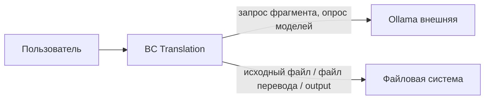

# Доменная модель TranslateText

Статус: **Согласовано** (`A0090`)  
Дата: 2026-08-26  
Назначение: ограниченные контексты, агрегаты, сущности, объекты-значения и инварианты для MVP локального перевода EN→RU.

Источники: `documentation/Specification.md`, `requirements/glossary.md`, `requirements/functional-requirements.md`, `requirements/non-functional-requirements.md` (только доменные правила), `requirements/user-stories/`, `requirements/use-cases/`, `requirements/answers-project.md` (`A0001`–`A0077`). Критичные правки после аудита: `reports/domain-model-review.md`. Соглашение об именах — `A0073`. Граница BC — `A0074`. Перенос §4 самостоятельного ревью — `A0075`. Базис очереди — `A0076`. Лимит имён `output` — `A0077`.

## Соглашение об именах

Описания и инварианты — на языке глоссария (русский).

Идентификаторы типов и атрибутов в таблицах — английский PascalCase / camelCase (1–2 слова) (`A0073`).

| Термин глоссария | Идентификатор |
| --- | --- |
| TranslateText (сеанс приложения) | `Workspace` |
| Очередь фрагментов текущего запуска «Перевести» | `QueueState` |
| Оригинальный текст | `originalText` / VO `SourceText` |
| Русский перевод | `translationText` / VO `TranslationText` |
| Кастомная инструкция | `customInstruction` |
| Базовый промпт переводчика | литерал A0006 в поле `customInstruction` |
| Модель Ollama | `ModelName` |
| Фрагмент | `Fragment` |
| Разбиение на фрагменты | служба `SplitText` |
| Автосохранение | `autosaveEnabled` |
| Папка output | каталог запуска + имя `output` (не отдельный корень) |
| Символ (для лимитов) | измерение длины Unicode, не тип |
| Пользователь | не сущность (нет учётки, A0002) |
| Ollama | внешняя система, не агрегат этого BC |
| Очередь выполняется | `inProgress` |
| Полный перевод очереди | `completed` |
| Перевод не завершён | `incomplete` (FT-028) |

Не смешивать: **очередь фрагментов** (`QueueState`) и **номер файла** `translate-NNNN.txt` (производный от содержимого папки `output`).

## Карта ограниченных контекстов

Один Core-контекст (`A0074`). Язык один: исходный текст, фрагменты, снимок инструкции и модели, склейка, страховка в `output`. Ollama — внешний движок за антикоррупционным слоем, не второй BC. Отдельный BC «файлы» не выделен: исходный файл и файл перевода — команды к тому же сеансу.

| BC | Subdomain | Зачем |
| --- | --- | --- |
| Translation | Core | Основной процесс: перевести текст локально фрагментами и не потерять результат |

Между контекстами своих Entity нет. На границу с Ollama уходят: текст фрагмента, снимок инструкции, имя модели; обратно — текст перевода фрагмента или отказ. Идентификатор модели — строка имени из ответа API, не общий класс с Ollama.

## Доменные службы

| Служба | Что делает | Чего не делает |
| --- | --- | --- |
| `SplitText` | Нарезает `SourceText` на список `Fragment` по FT-015…FT-018, FT-025, A0004, A0009, A0032 | Не вызывает Ollama; не пишет файлы |
| `ExtractSource` | Извлекает текст из исходного файла допустимого формата | Не стартует перевод (FT-003, FT-039) |
| `StartTranslation` | Координация старта очереди: согласие FT-029, снимок, нарезка, запрет второго запуска | Не держит GPU-нормы НФТ |
| `ExportTranslation` | Пишет выбранный Пользователем файл перевода (FT-004) | Не очищает поля сеанса; не заменяет автосохранение (A0022) |
| `OllamaGateway` | Антикоррупционный слой: опрос списка моделей, перевод одного фрагмента на локальный адрес | Не хранит оригинал; не пишет `output` |

## Вне MVP

- Учётки и несколько сеансов (A0002).
- Отмена очереди Пользователем после старта (A0044).
- Другие пары языков, определение языка (A0044).
- Облачный перевод, свой HTTP-сервер TranslateText.
- Память прошлых переводов, CAT, вычитка.
- Журнальный файл для Пользователя (A0027).

Пороги NFT-001 / NFT-002 (секунды до UI, p95 GPU) — не инварианты домена. Условие сбоя «нет ответа дольше 60 с» входит в FT-028 / A0031 — это правило обрыва очереди, не норма производительности.

---

## Translation

Сеанс TranslateText: поля оригинала и перевода, кастомная инструкция, выбранная модель, текущая очередь фрагментов, автосохранение в `output`.

### Агрегат: Workspace

Единственная точка входа в оперативное состояние сеанса. Поля и текущая очередь меняются согласованно: нельзя начать вторую очередь, пока первая не закончилась или не оборвалась (FT-031); снимок модели и инструкции фиксируется на старте этой очереди (FT-011, A0052); полный или неполный перевод в «Русский перевод» и запись в `output` относятся к тому же сеансу (FT-028, FT-034, FT-036).

Учётки нет: идентичность корня — единственный сеанс запущенного приложения (A0002), не личность и не хранимый UUID.

#### 1. Сущности (Entities)

| Сущность | Атрибут | Тип данных (Бизнес) | Обязательность | Правила / Валидация | Описание |
| :--- | :--- | :--- | :--- | :--- | :--- |
| Workspace (корень) | originalText | VO SourceText | да (может быть пустым) | Длина — символы Unicode (FT-030). Поле может быть длиннее 100 000; вызов Ollama при длине > 100 000 запрещён (FT-014, FT-023) | Канон: «Оригинальный текст» |
| Workspace | translationText | VO TranslationText | да (может быть пустым) | Единственное хранимое представление текущего русского текста: в ходе очереди — склейка завершённых фрагментов; после успеха — полный перевод (замена, не дописывание, FT-035); после сбоя — уже склеенный кусок (FT-028) | Канон: «Русский перевод» |
| Workspace | customInstruction | строка | да (может быть пустой) | Пока Пользователь не менял — литерал базового промпта (FT-008, A0006). Пустое значение при «Перевести» не уходит в Ollama молча (FT-029) | Канон: «Кастомная инструкция» |
| Workspace | selectedModel | VO ModelName | нет | При старте сеанса, если API вернул непустой список: `qwen2.5:3b` если есть, иначе первая (FT-041, A0045). Пусто, если список пуст (FT-024) | Канон: выбранная «Модель» |
| Workspace | autosaveEnabled | логический | да | При старте сеанса true (FT-033, A0018). Пустой перевод не запрещает менять галочку (A0040) | Канон: галочка «Автосохранение» |
| Workspace | lastAutosavedBody | строка | нет | Текст, уже записанный как последнее автосохранение; запрет второй копии полного перевода (FT-036, A0035) | Не номер файла и не id очереди |
| Workspace | queue | VO QueueState | нет | Не более одной текущей очереди; пока `status = inProgress` новой очереди нет (FT-031) | Не Entity: нет жизни вне сеанса и нет поиска по id запуска |

#### 2. Объекты-Значения (Value Objects)

| Объект-Значение | Атрибут | Тип данных (Бизнес) | Правила / Валидация | Описание |
| :--- | :--- | :--- | :--- | :--- |
| QueueState | status | enum | Только: `inProgress`, `completed`, `incomplete`. Нет литерала отмены (A0044) | Соответствие: выполняется / полный перевод / перевод не завершён (FT-028) |
| QueueState | snapshot | VO QueueSnapshot | Фиксируется после согласия FT-029, если оно было; иначе на старте «Перевести» (FT-011, A0052) | Снимок на всю очередь |
| QueueState | fragments | набор VO Fragment | Порядок исходного текста; ни один не длиннее 5000; целевой размер 4000–5000, кроме единственного/последнего (FT-017, A0032) | Результат `SplitText`, не Entity |
| QueueState | nextIndex | целое | Индекс следующего фрагмента к отправке; с 0; после успеха +1; при `completed` равен числу фрагментов; следующий к отправке имеет `order = nextIndex` (A0076) | Очередь строго по порядку (FT-019) |
| SourceText | value | строка | Длина в символах Unicode. Содержимое — английский исходный (канон ТЗ); определение языка вне MVP (A0044) | Значение левого поля / извлечённый текст файла |
| TranslationText | value | строка | Результат локального перевода на русский | Значение правого поля |
| QueueSnapshot | instruction | строка | На старте очереди непустая (после FT-029 в поле уже базовый промпт) | Снимок кастомной инструкции |
| QueueSnapshot | model | ModelName | Обязательна на старте очереди | Снимок выбранной модели |
| ModelName | value | строка | Имя из ответа локального API без фильтра по семейству (A0010) | Не чекпоинт Stable Diffusion |
| Fragment | order | целое | Позиция в очереди с 0; в очереди из n фрагментов — 0 … n−1; не глобальный id (A0076) | Порядок исходного текста |
| Fragment | source | SourceText | Длина 1…5000 Unicode; при нарезке целевой 4000–5000, кроме единственного/последнего | Кусок на один запрос Ollama |
| SourceFormat | value | enum | Только `txt`, `md`, `docx`, `pdf` (FT-042, A0046) | Формат исходного файла |
| ExportFormat | value | enum | Только `txt`, `docx` (FT-046, A0054) | Формат файла перевода |
| AutosaveName | sequence | целое | Производное: следующий свободный номер в диапазоне 0001…9999 по существующим `translate-NNNN.txt`; существующие не перезаписывать (A0021). Если свободного номера нет — файл не создавать, предупредить о превышении лимита и попросить очистить папку `output` (A0077). Не расширять имя до 5+ цифр | Имя `translate-NNNN.txt`; не второй id запуска |

#### 3. Бизнес-инварианты и правила

- Создание сеанса: при открытии TranslateText существует ровно один `Workspace`. Отдельного id личности нет (A0002). Невалидный сеанс (без полей оригинала/перевода/инструкции) не существует.
- Старт очереди запрещён, если `originalText` пуст (FT-026, A0011) — `queue` не создаётся.
- Старт запрещён, если длина `originalText` > 100 000 символов Unicode: Ollama не вызывать, текст не обрезать, сообщить о превышении (FT-023, A0036). `queue` не существует.
- Старт запрещён, если нет ответа API моделей или список пуст: очередь не создавать, оригинал не очищать, показать запуск `start_ollama.bat` в `F:\Docker\Ollama` (FT-024, A0008).
- Если `customInstruction` пуста и есть оригинал: без согласия на базовый промпт очередь не создавать; при согласии подставить литерал A0006 в поле и только затем фиксировать снимок (FT-029, A0050). Диалог согласия — UI; домен принимает команду старта только после согласия или при уже непустой инструкции.
- На старте допустимой очереди: зафиксировать `QueueSnapshot`; смена `customInstruction` и `selectedModel` до конца этой очереди на запросы фрагментов не влияет (FT-011, A0052, NFT-014).
- Пока `queue.status = inProgress`, команда «Перевести» нелегальна (FT-031, A0017). Правка инструкции/модели и просмотр полей не отменяют очередь и не пересобирают снимок (A0044 вне MVP).
- Нарезка только службой `SplitText`: Пользователь границы не задаёт (FT-021). Текст ≤ 5000 — один фрагмент (FT-016). Длиннее — очередь, не один запрос на весь текст (FT-019, A0004).
- `translationText` и склейка очереди — один факт: после каждого завершённого фрагмента правое поле содержит склейку фрагментов с `order < nextIndex`; отдельного атрибута «склейка» нет.
- Новый успешный полный перевод заменяет `translationText`, не конкатенирует со старым (FT-035).
- Сбой фрагмента, ошибка выбранной модели или отсутствие ответа дольше 60 с (FT-028, A0031, A0044): `status = incomplete`; `translationText` не укорачивать относительно склейки уже успешных фрагментов; не помечать как полный. `nextIndex` не идёт дальше.
- Запросы перевода только на локальный адрес Ollama (FT-012, FT-013) — инвариант `OllamaGateway`.
- Загрузка исходного файла: при успехе заменить `originalText` (FT-003). При отмене диалога `originalText` не менять (FT-047, A0058). Если формат допустим, а текст не извлечён — не стартовать перевод и не оставлять поле пустым молча без сообщения (FT-039, A0029).
- Ручной экспорт — служба `ExportTranslation` (FT-004): пишет выбранный Пользователем файл, не очищает поля сеанса; при отмене замены диск не меняет (FT-043, A0047); сбой записи не стирает `translationText` (FT-044).
- При пустом `translationText` команда «Сохранить перевод» нелегальна (FT-027). Галочку «Автосохранение» по этой причине менять не запрещать (A0040).
- Если `autosaveEnabled = false`, файлы в `output` не создавать и не писать (A0020, FT-034, FT-036).
- Автосохранение: если `autosaveEnabled` и очередь `completed` — при отсутствии папки `output` в каталоге запуска создать её (FT-037) и записать `translationText` следующим свободным `translate-NNNN.txt` в диапазоне 0001…9999 (FT-034, A0077). Перед новым запуском при непустом правом поле: записать, если текст ещё не равен `lastAutosavedBody`; полный уже записанный не копировать; `incomplete` записать (FT-036, A0035). Сбой записи не меняет поля и не запрещает ручное сохранение (FT-040). Если свободного номера в 0001…9999 нет — файл не создавать, предупредить о превышении лимита и попросить очистить папку (A0077); `status` из‑за лимита имён не переводить в `incomplete`; ручное сохранение не запрещать (A0094). Номер NNNN не хранить вторым счётчиком запуска.
- После опроса моделей: не сбрасывать `selectedModel`, если имя ещё в ответе; иначе FT-041 (A0053). Список — все имена API (FT-005, A0010). Момент опроса (старт, клик, фокус) — `OllamaGateway` / FT-045, не отдельный атрибут сеанса.
- Доля прогресса — производное UI от суммы символов исходных фрагментов с `order < nextIndex` к длине всего исходного текста очереди (FT-022). Не хранить второй процент.
- Блокировка кнопок — UI поверх пустого поля и `inProgress`; домен запрещает команды, а не виджеты.

Доменные события (не отдельные агрегаты): `TranslationStarted`, `FragmentTranslated`, `TranslationCompleted`, `TranslationFailed`, `AutosaveWritten`, `AutosaveFailed`, `SourceLoaded`, `SourceLoadFailed`, `ModelsRefreshed`, `OllamaUnavailable`.

#### 4. Связи

| От | К | Кратность | Как связывается |
| --- | --- | --- | --- |
| Workspace | QueueState | 0..1 | Внутри агрегата, VO `queue` |
| QueueState | QueueSnapshot | 1 | Внутри агрегата, VO |
| QueueState | Fragment | 1..* | Внутри агрегата, набор VO |
| Workspace | ModelName | 0..1 | VO `selectedModel`; не объект Ollama |
| Workspace | файлы `output` | 0..* | Не коллекция корней: имена выводятся из каталога |
| Translation | Ollama | — | Только через `OllamaGateway`: имя модели и тексты |

### Служба: SplitText

Сущностей нет. Вход: `SourceText`. Выход: упорядоченный список `Fragment`.

Инварианты нарезки: FT-015, FT-016, FT-017, FT-018, FT-025, A0004, A0009, A0032. Служба не пишет `Workspace` и не вызывает Ollama.

### Служба: ExtractSource

Сущностей нет. Вход: путь и `SourceFormat`. Выход: `SourceText` или отказ FT-039.

### Служба: ExportTranslation

Сущностей нет. Вход: `TranslationText` и `ExportFormat`, путь, выбранный Пользователем. Пишет файл перевода (FT-004). Не очищает `Workspace`. При отмене замены существующего файла диск не меняет (FT-043). Сбой записи не стирает `translationText` (FT-044).

---

## Сводка идентификаторов между агрегатами

В MVP один агрегат (`Workspace`). Ссылок на другие корни нет. Внешняя система Ollama адресуется локальным адресом из среды, не id нашего агрегата.

## Допущения модели

- Оперативное состояние сеанса в источниках не описано как файл настроек после закрытия окна.
- Текст базового промпта не дублируется отдельным атрибутом, если он уже в `customInstruction`.
- 60 с без ответа — переход очереди в `incomplete` по FT-028 / A0031, не порог NFT-001.

## Открытые вопросы

Открытых вопросов нет. Закрыты: DDD-1 → `A0073`; DDD-2 → `A0074`; перенос §4 ревью → `A0075`.
