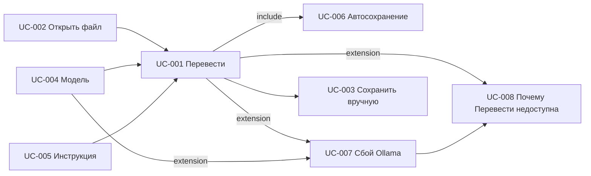

# Реестр Use Cases TranslateText

Статус пакета: **Согласовано** (`A0089`)  
Дата: 2026-08-26  
Роли: `requirements/user-stories/list-us.md` (Пользователь — primary; Ollama — системный участник)

## Источники правды

- `documentation/Specification.md`
- `requirements/glossary.md`
- `requirements/functional-requirements.md` (согласованные ФТ, `A0086`)
- `requirements/non-functional-requirements.md` (согласованные НФТ, `A0087`)
- `requirements/answers-project.md` (`A0001`–`A0089`)
- `requirements/user-stories/` (US-001 … US-008)

Декомпозиция: **1:1 к пакету User Stories**. UC-006 — subfunction (include из UC-001). UC-007 — extension UC-001 и UC-004. UC-008 — user goal; вызывается при заблокированной «Перевести» из UC-001 / UC-007.

## Реестр

| ID | Название | Файл | Основной актор | Связанные US | Статус |
| --- | --- | --- | --- | --- | --- |
| UC-001 | Перевести оригинальный текст | `uc-001-translate-text.md` | Пользователь | US-001 | готово |
| UC-002 | Открыть исходный файл | `uc-002-open-file.md` | Пользователь | US-002 | готово |
| UC-003 | Сохранить перевод вручную | `uc-003-save-translation.md` | Пользователь | US-003 | готово |
| UC-004 | Выбрать модель Ollama | `uc-004-select-model.md` | Пользователь | US-004 | готово |
| UC-005 | Задать кастомную инструкцию | `uc-005-custom-instruction.md` | Пользователь | US-005 | готово |
| UC-006 | Автосохранение перевода | `uc-006-autosave.md` | Пользователь | US-006 | готово |
| UC-007 | Понять сбой Ollama и не потерять кусок перевода | `uc-007-ollama-unavailable.md` | Пользователь | US-007 | готово |
| UC-008 | Понять, почему «Перевести» недоступна | `uc-008-translate-unavailable-reason.md` | Пользователь | US-008 | готово |

## Связи сценариев

| От | К | Тип |
| --- | --- | --- |
| UC-002 | UC-001 | предшествует (текст в левом поле) |
| UC-004 | UC-001 | предшествует (выбранная модель) |
| UC-005 | UC-001 | предшествует (кастомная инструкция) |
| UC-001 | UC-006 | include (полный перевод и страховка перед заменой) |
| UC-001 | UC-007 | extension (недоступность / сбой фрагмента) |
| UC-004 | UC-007 | extension (пустой список / нет API) |
| UC-001 | UC-008 | extension (подсказка у заблокированной «Перевести») |
| UC-007 | UC-008 | предшествует (недоступность Ollama — одна из причин подсказки) |
| UC-001 | UC-003 | после успеха Пользователь может сохранить вручную |

## Покрытие акторов

| Актор | Покрытие |
| --- | --- |
| Пользователь | primary во всех UC-001 … UC-008 |
| Ollama | supporting в UC-001, UC-004, UC-005, UC-007, UC-008; в UC-006 interested (не пишет файлы) |

Отдельного UC от лица Ollama нет.

## Вне MVP / вне scope

- Отмена перевода Пользователем после старта очереди (`A0044`).
- Определение языка / пары кроме EN→RU (`A0044`).
- Учётки, гость, администратор, несколько Пользователей (`A0002`).
- Выбор Gradio vs Streamlit.
- Облачный перевод и свой HTTP-сервер TranslateText.
- Качество перевода «как человек», BLEU.
- Файл журнала для Пользователя (`A0027`); технический журнал URL — вопрос разработки в US (`Q-DEV-1`), не отдельный UC.
- Автоопрос API моделей при возврате фокуса в окно без клика или фокуса на «Модель» (`A0079`).

## Открытые вопросы пакета

Открытых вопросов нет.

## Закрытые вопросы

| ID вопроса | Axxxx |
| --- | --- |
| UC-002-C1 | A0046 |
| UC-003-C1 | A0047 |
| UC-003-C2 | A0048 |
| UC-004-C1 | A0049 |
| UC-005-C1 | A0050 |
| QC US/UC №7 (отмена «Открыть файл») | A0058 |
| QC US/UC №1 (снимок модели) | A0059 |
| QC US/UC №2 (UC-005 §5.5) | A0060 |
| QC US/UC №3 (триггеры UC-006/007) | A0061 |
| QC US/UC №4 (поток UC-001) | A0062 |
| QC US/UC №5 (US-002 AC3) | A0063 |
| QC US/UC №6 (US-007 AC1) | A0064 |
| QC US/UC №8 (термин «актуальная») | A0065 |
| QC US/UC №9 (связанные ФТ US-001) | A0066 |
| QC US/UC №10 (UC-002 E1/E2) | A0067 |
| QC US/UC (2) №1 (поток UC-003) | A0068 |
| QC US/UC (2) №2 (возврат UC-005) | A0069 |
| QC US/UC (2) №3 (UC-001 §5.5) | A0070 |
| QC US/UC (2) №4 (UC-002 [Шаг 5.2]) | A0071 |
| QC US/UC (2) №5 (NFT-014) | A0072 |
| QC US/UC (4) №1 (FT-049 в UC-001) | A0083 |
| QC US/UC (4) №2 (UC-008 E2) | A0084 |
| QC US/UC (4) №3 (поток UC-008) | A0085 |

Выбор модели при старте ранее закрыт как `A0045` (из Q-US-1) и отражён в UC-004.

## Итог самопроверки при написании (§10 skill-uc)

Дата: 2026-08-26. После выравнивания с FT-048…FT-050 и US-008: ok.

- Все UC-001 … UC-008 в статусе «готово».
- UC-008 — 1:1 к US-008 (канон декомпозиции реестра; рекомендация QC-строки 2). Отдельного `Axxxx` на этот выбор нет.
- Триггер UC-007 без «выполняет Перевести» (A0078, A0079).
- Замечаний-блокеров самопроверки нет. E2 UC-008 (приоритет FT-031 над FT-048) следует из FT-050.

Это не отчёт `/qc-us-uc`.

## Итог `/qc-us-uc` (2026-08-26)

Первый прогон обработан (`A0058`–`A0067`). Второй прогон обработан (`A0068`–`A0072`). Четвёртый прогон обработан (`A0083`–`A0085`): `reports/incompatibility-us-uc.md` — **Обработано**. Находок было 3 (критичных 0, важных 0, желательных 3). Правки: UC-001, UC-008.

Повторный `/qc-us-uc` по этим правкам не предлагается.

## Рекомендуемый следующий шаг

Канон ФТ/НФТ после QC обработан (`A0092`–`A0095`). Реализация MVP: `/use-tests` по текущим UI-тестам, затем код поверх макета.
