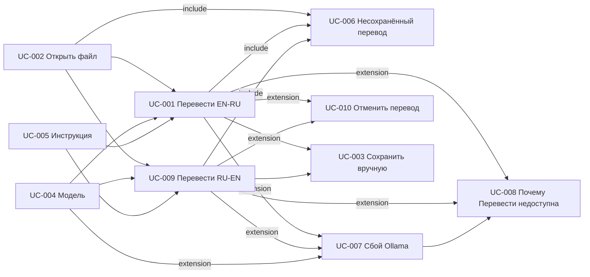

# Реестр Use Cases TranslateText

Статус пакета: **Согласовано** (`A0126`; UC-010 — `A0156`).  
Дата: 2026-08-30  
Роли: `requirements/user-stories/list-us.md` (Пользователь — primary; Ollama — системный участник)

## Источники правды

- `documentation/Specification.md`
- `requirements/glossary.md` (`A0128`)
- `requirements/functional-requirements.md` (согласовано, `A0125`)
- `requirements/non-functional-requirements.md` (согласовано, `A0127`; NFT-014 — `A0129`)
- `requirements/domain-model.md` (`A0138`), `requirements/data-dictionary.md` (`A0139`)
- `requirements/answers-project.md` (`A0001`–`A0155`)
- `requirements/user-stories/` (US-001 … US-010; пакет US-001…009 согласован, `A0132`; US-010 — черновик S-07c)

Декомпозиция: **1:1 к пакету User Stories**. UC-006 — subfunction (include из UC-001, UC-009 и UC-002). UC-007 — extension UC-001, UC-009 и UC-004. UC-008 — user goal; вызывается при заблокированной «Перевести» из UC-001 / UC-009 / UC-007. UC-010 — extension UC-001 и UC-009 (отмена очереди, FT-054).

## Реестр

| ID | Название | Файл | Основной актор | Связанные US | Статус |
| --- | --- | --- | --- | --- | --- |
| UC-001 | Перевести оригинальный текст | `uc-001-translate-text.md` | Пользователь | US-001 | готово |
| UC-002 | Открыть исходный файл | `uc-002-open-file.md` | Пользователь | US-002 | готово |
| UC-003 | Сохранить перевод вручную | `uc-003-save-translation.md` | Пользователь | US-003 | готово |
| UC-004 | Выбрать модель Ollama | `uc-004-select-model.md` | Пользователь | US-004 | готово |
| UC-005 | Задать кастомную инструкцию | `uc-005-custom-instruction.md` | Пользователь | US-005 | готово |
| UC-006 | Предупредить о несохранённом переводе | `uc-006-unsaved-translation-warning.md` | Пользователь | US-006 | готово |
| UC-007 | Понять сбой Ollama и не потерять кусок перевода | `uc-007-ollama-unavailable.md` | Пользователь | US-007 | готово |
| UC-008 | Понять, почему «Перевести» недоступна | `uc-008-translate-unavailable-reason.md` | Пользователь | US-008 | готово |
| UC-009 | Перевести оригинальный текст на английский | `uc-009-translate-ru-en.md` | Пользователь | US-009 | готово |
| UC-010 | Отменить перевод | `uc-010-cancel-translation.md` | Пользователь | US-010 | готово |

UC-001 и UC-009 в статусе «готово» как сценарии. UC-010 — готово (`A0156`).

## Связи сценариев

| От | К | Тип |
| --- | --- | --- |
| UC-002 | UC-001 | предшествует (текст в левом поле) |
| UC-002 | UC-009 | предшествует (текст в левом поле) |
| UC-004 | UC-001 | предшествует (выбранная модель) |
| UC-004 | UC-009 | предшествует (выбранная модель) |
| UC-005 | UC-001 | предшествует (кастомная инструкция) |
| UC-005 | UC-009 | предшествует (кастомная инструкция) |
| UC-001 | UC-006 | include (предупреждение перед «Перевести» при несохранённом переводе) |
| UC-009 | UC-006 | include (то же) |
| UC-002 | UC-006 | include (предупреждение перед «Открыть файл» при несохранённом переводе) |
| UC-001 | UC-007 | extension (недоступность / сбой фрагмента) |
| UC-009 | UC-007 | extension (недоступность / сбой фрагмента) |
| UC-004 | UC-007 | extension (пустой список / нет API) |
| UC-001 | UC-008 | extension (подсказка у заблокированной «Перевести») |
| UC-009 | UC-008 | extension (подсказка у заблокированной «Перевести») |
| UC-007 | UC-008 | предшествует (недоступность Ollama — одна из причин подсказки) |
| UC-001 | UC-010 | extension (отмена очереди, FT-054) |
| UC-009 | UC-010 | extension (отмена очереди, FT-054) |
| UC-001 | UC-003 | после успеха Пользователь может сохранить вручную |
| UC-009 | UC-003 | после успеха Пользователь может сохранить вручную |

## Покрытие акторов

| Актор | Покрытие |
| --- | --- |
| Пользователь | primary во всех UC-001 … UC-010 |
| Ollama | supporting в UC-001, UC-004, UC-005, UC-007, UC-008, UC-009, UC-010 |

Отдельного UC от лица Ollama нет.

## Вне MVP / вне scope

- Определение языка исходного текста (`A0044`; `A0119`).
- Другие пары языков, кроме EN→RU и RU→EN (`A0119`).
- Учётки, гость, администратор, несколько Пользователей (`A0002`).
- Выбор Gradio vs Streamlit.
- Облачный перевод и свой HTTP-сервер TranslateText.
- Качество перевода «как человек», BLEU.
- Файл журнала для Пользователя (`A0027`); технический журнал URL — вопрос разработки в US (`Q-DEV-1`), не отдельный UC.
- Автоопрос API моделей при возврате фокуса в окно без клика или фокуса на «Модель» (`A0079`).

## Открытые вопросы пакета

Открытых вопросов нет.

## Закрытые вопросы

| ID вопроса | Axxxx |
| --- | --- |
| UC-002-C1 | A0046 |
| UC-003-C1 | A0047 |
| UC-003-C2 | A0104 |
| UC-004-C1 | A0049 |
| UC-005-C1 | A0050 |
| QC US/UC №7 (отмена «Открыть файл») | A0058 |
| QC US/UC №1 (снимок модели) | A0059 |
| QC US/UC №2 (UC-005 §5.5) | A0060 |
| QC US/UC №3 (триггеры UC-006/007) | A0061 |
| QC US/UC №4 (поток UC-001) | A0062 |
| QC US/UC №5 (US-002 AC3) | A0063 |
| QC US/UC №6 (US-007 AC1) | A0064 |
| QC US/UC №8 (термин «актуальная») | A0065 |
| QC US/UC №9 (связанные ФТ US-001) | A0066 |
| QC US/UC №10 (UC-002 E1/E2) | A0067 |
| QC US/UC (2) №1 (поток UC-003) | A0068 |
| QC US/UC (2) №2 (возврат UC-005) | A0069 |
| QC US/UC (2) №3 (UC-001 §5.5) | A0070 |
| QC US/UC (2) №4 (UC-002 [Шаг 5.2]) | A0071 |
| QC US/UC (2) №5 (NFT-014) | A0072 |
| QC US/UC (4) №1 (FT-049 в UC-001) | A0083 |
| QC US/UC (4) №2 (UC-008 E2) | A0084 |
| QC US/UC (4) №3 (поток UC-008) | A0085 |
| QC FT/NFT (порядок FT-032 → FT-029 в UC-001 / UC-005) | A0114 |
| Q-US-4 (RU→EN в MVP) | A0119 |
| Q-US-5 (элемент направления) | A0120 |
| Q-US-6 (одно поле перевода) | A0121 |
| Q-US-7 (базовый промпт RU→EN) | A0122 |
| Q-US-8 (смена промпта при смене направления) | A0123 |
| Q-FT-1 (текст поля перевода при смене направления) | A0124 |
| Аудит рассинхрона (list-uc, UC-007, NFT-014 в UC-001/009) | A0137 |
| US-010 / UC-010 (S-07c) | A0156 |
| QC US/UC UC-010 §5.3 | A0157 |

Выбор модели при старте ранее закрыт как `A0045` (из Q-US-1) и отражён в UC-004.

## Итог самопроверки при написании (§10 skill-uc)

Дата: 2026-08-30. После UC-010 (S-07c): ok.

- UC-001 … UC-010; primary везде Пользователь.
- UC-010 — 1:1 к US-010; extension UC-001 и UC-009; 6 шагов; 6 категорий альтернатив; 2 исключения.
- Додуманных веток без Axxxx нет (E1/E3 из A0158 / A0152; E2 из A0148 / A0153).
- Замечаний-блокеров самопроверки нет.

Это не отчёт `/qc-us-uc`.

## Итог `/qc-us-uc` (2026-08-30)

**Обработано:** `reports/incompatibility-us-uc.md` — `A0157` (UC-010 §5.3). Повторный `/qc-us-uc` по этим правкам не предлагается.

## Рекомендуемый следующий шаг

`/frontend` среза S-07c (хром кнопки и сообщение об отмене).
